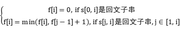
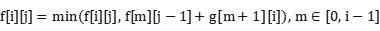
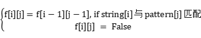
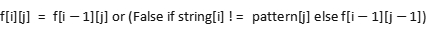

首先明确两个概念：**子串与子序列**。
比如一个字符串“aaabbc”的一个子串为“aaa”。而“abc”是它的一个子序列。即子串必须是在字符串中连续的，而子序列可不连续，但在字符串中的索引需要是升序的（“cba”就不是子序列）。

## 回文问题

回文字符串指正序遍历和逆序遍历完全相同的字符串。
一个简单的题目认识回文字符串。

“回文串”是一个正读和反读都一样的字符串，比如“level”或者“noon”等等就是回文串。花花非常喜欢这种拥有对称美的回文串，生日的时候她得到两个礼物分别是字符串A和字符串B。现在她非常好奇有没有办法将字符串B插入字符串A使产生的字符串是一个回文串。你接受花花的请求，帮助她寻找有多少种插入办法可以使新串是一个回文串。如果字符串B插入的位置不同就考虑为不一样的办法。

```
例如：
A = “aba”，B = “b”。这里有4种把B插入A的办法：

在A的第一个字母之前: "baba" 不是回文

在第一个字母‘a’之后: "abba" 是回文

在字母‘b’之后: "abba" 是回文

在第二个字母'a'之后 "abab" 不是回文
所以满足条件的答案为2
```


```python
def solution(A, B):
    res = 0
    for i in range(len(A)+1):
        tmp = A[:i]+B+A[i:]
        if tmp == tmp[::-1]:  # 判断正序遍历和逆序是否相同
            res += 1
    return res
```

Leetcode131[分割回文串](https://leetcode-cn.com/problems/palindrome-partitioning/)

给你一个字符串 s，请你将 s 分割成一些子串，使每个子串都是 回文串 。返回 s 所有可能的分割方案。


```python
def solution(s):
    def dfs(rest, path):
        # path存储回文子串
        if rest == "":
            res.append(path)
            return
        for i in range(len(rest)):
            # 返回 s 所有可能的分割方案，枚举剩余字符串可能的分割方法
            if rest[:i+1] == rest[:i+1][::-1]:  # 只有当前子串是回文时，才计入path
                dfs(rest[i+1:], path + [rest[:i+1]])
            return
    res = []
    return dfs(s, [])
```

Leetcode132[分割回文串 II](https://leetcode-cn.com/problems/palindrome-partitioning-ii/)

给你一个字符串 s，请你将 s 分割成一些子串，使每个子串都是 回文串 。返回最小的分割次数。

1 <= s.length <= 2000，暴力解法超时。

通过动态规划预处理（check函数），采用一个数组存储s[i, j]是否为回文子串。避免反复判断是否回文。

最小分割次数的计算：

状态：f[i]表示以i结尾的子串分割为回文子串的最小分割次数。

转移方程：



```python
def solution(s):
    dp = [[0]*len(s) for _ in range(len(s))]
    dp[0][0] = True
    def check(s):
        # dp[i][j]存储从i-j的子串是否是回文的
        for r in range(len(s)):  # 右边的索引
            for l in range(r+1):  # l要取到r
                if r == l:
                    dp[l][r] = True
                    continue
                if s[r] == s[l]:
                    if (l+1 <= r-1 and dp[l+1][r-1] is True) or r-l == 1:
                        dp[l][r] = True
                    else:
                        dp[l][r] = False
                else:
                    dp[l][r] = False
        return
    min_split = [float('inf')]*len(s)  # 表示以i结尾的子串最少要分割几次
    min_split[0] = 0
    for i in range(1, len(s)):
        if dp[0][i] is True:  # 0-i是一个回文串
            min_split[i] = 0
        else:  # 非回文，分割子区间，取最小的分割值，前面的回文串最长时
            tmp = float('inf')
            # i单独分割一次或者与前面的某个位置形成回文，一起分割
            for j in range(1, i):
                if dp[j][i] is True:
                    tmp = min(tmp, 1 + min_split[j-1])
            min_split[i] = tmp
	return min_split[-1]
```

Leetcode[1278. 分割回文串 III](https://leetcode-cn.com/problems/palindrome-partitioning-iii/)

给你一个由小写字母组成的字符串 s，和一个整数 k。

请你按下面的要求分割字符串：

1.首先，你可以将 s 中的部分字符修改为其他的小写英文字母。
2.接着，你需要把 s 分割成 k 个非空且不相交的子串，并且每个子串都是回文串。（不相交指索引不相交）
请返回以这种方式分割字符串所需修改的最少字符数。

同样以预处理+动态规划解题。

预处理：记g[i] [j]为s[i, j]修改为回文串所需要修改的字符数。

状态：f[i] [j]指以i结尾的子串划分为j(j取[0, k])个回文子串所需的最少字符数。

转移方程：

枚举将s[m+1, i]作为一个回文子串，前面s[0, m]划分为j-1个子串。



初始化：

令f[i] [1] = g[0] [i]。

```python
def solution(s, k):
    # min_cost[i][j]以i结尾的子串被分割为j个回文子串需要的最小修改次数
    # min_cost[i][j] = min(min_cost[i][j], min_cost[m][j-1]+dp[m+1][i])
    dp = [[0]*len(s) for _ in range(len(s))]  # s[i, j]修改为回文的消耗次数
    min_cost = [[float('inf')]*(k+1) for _ in range(len(s))]
    def cost(s):
        for r in range(len(s)):
            for l in range(r+1):
                if r == l:
                    dp[l][r] = 0
                    continue
                if s[l] == s[r]:
                    if r-l > 1:
                        dp[l][r] = dp[l+1][r-1]
                    else:
                        dp[l][r] = 0
                else:
                    if l+1<= r-1:
                        dp[l][r] = 1 + dp[l+1][r-1]
                    else:
                        dp[l][r] = 1
        return
    cost(s)
    for i in range(len(s)):
        min_cost[i][1] = dp[0][i]
        for j in range(2, k+1):
            for m in range(i):
                # s[m, i]作为最后一个回文子串
                min_cost[i][j] = min(min_cost[i][j], min_cost[m][j-1]+dp[m+1][i])
    return min_cost[len(s)-1][k]
```

## 字符串编辑问题

MGJ5[回文串](https://www.nowcoder.com/practice/655a43d702cd466093022383c24a38bf?tpId=182&tqId=34631&rp=1&ru=%2Fta%2Fexam-all&qru=%2Fta%2Fexam-all%2Fquestion-ranking&tab=answerKey)
给定一个字符串，问是否能通过添加一个字母将其变为回文串。

输出答案(YES\NO)。

对于添加一个字母变成回文串等价于丢弃一个字母变成回文串。

原本要枚举L^26种插入的情况，变成枚举L种删除的情况。

```
def solution(s):
    res = "NO"
    for i in range(len(s)):
        tmp = s[:i]+s[i+1:]
        if tmp == tmp[::-1]:
            res = "YES"
            break
	return res
```

OR89[字符串问题](https://www.nowcoder.com/practice/ce968b4765d94c45af3f639c133da040?tpId=182&tqId=34815&rp=1&ru=%2Fta%2Fexam-all&qru=%2Fta%2Fexam-all%2Fquestion-ranking&tab=answerKey)

小摩手里有一个字符串A，小拜的手里有一个字符串B，B的长度大于等于A，所以小摩想把A串变得和B串一样长，这样小拜就愿意和小摩一起玩了。

而且A的长度增加到和B串一样长的时候，对应的每一位相等的越多，小拜就越喜欢。比如"abc"和"abd"对应相等的位数为2，为前两位。

小摩可以在A的开头或者结尾添加任意字符，使得长度和B一样。现在问小摩对A串添加完字符之后，不相等的位数最少有多少位？

这类对字符串a加上一个字符的操作，基本上可以转化为对字符串b删去一个字符来求解。

问题转化为b的开头或结尾删去一个字母，使得不相等的位数最小。

```python
def solution(A, B):
    dp = {}  # 存储b对应最小不相等位数
    def dfs(a, b):
        if len(a) == len(b):  # b的长度与a相等判断不相等位数
            n = len(a)
            st = 0
            count = 0
            while st<n:
                if a[st] != b[st]:
                    count += 1
                st += 1
            return count
        if dp.get(b):  # 避免重复搜索
            return dp[b]
        ans = float('inf')
        ans = min(ans, dfs(a, b[1:]), dfs(a, b[:-1]))  # 分别搜索b删除首字母和尾字母的结果
        dp[b] = ans
        return ans
    return dfs(A, B)
```

[面试题 01.05. 一次编辑](https://leetcode-cn.com/problems/one-away-lcci/)

字符串有三种编辑操作:插入一个字符、删除一个字符或者替换一个字符。 给定两个字符串，编写一个函数判定它们是否只需要一次(或者零次)编辑。

```
输入: 
	first = "pale"
	second = "ple"
输出: True
```

因为最多只能做一次编辑，所以两个字符串的长度之差大于1时无法通过一次编辑使之相同。

长度之差为1时，对较短字符串插入一个字符的操作等价于从较长字符串删除一个字符的操作。

长度之差为0时，只能做一次替换操作。

```python
def solution(first, second):
	gap = abs(len(first)-len(second))
    if gap > 1:
        return False
    elif first == second:
        return True
    if len(first) < len(second):  # 使first是较长的字符串
        first, second = second, first
    n = len(first)
    m = len(second)
    count = 0
    if n-m == 0:
        for i in range(n):
            if first[i] != second[i]:
                count += 1
        return count <= 1
    else:
        for i in range(n):  # 删除first中的每一字母
            if first[:i]+first[i+1:] == second:
                return True
        return False
```

Leetcode[72. 编辑距离](https://leetcode-cn.com/problems/edit-distance/)

给你两个单词 word1 和 word2，请你计算出将 word1 转换成 word2 所使用的最少操作数 。

你可以对一个单词进行如下三种操作：

1. 插入一个字符
2. 删除一个字符
3. 替换一个字符

一次编辑的升级版，类比**两个字符串匹配。（先看下一节再回来看这一题）**

同样用删除一字符替换插入一个字符，则每次可以进行的操作为：

替换一个字符，删除word1的一个字符，删除word2的一个字符。

状态：f[i] [j]存储w1[0, i]与w2[0, j]变成相同字符串的最小编辑次数。

转移方程：

1. 替换w1[i] or w2[j], 使w1[i]=w2[j] ，f[i-1] [j-1]+1

2. 删除w1[i], 使w1[0, i-1]与w2[0, j]变成相同子符串 ，f[i-1] [j]+1

3. 删除w2[j], 使w1[0, i]与w2[0, j-1]变成相同子符串 ， f[i] [j-1]+1

f[i] [j] = min(f[i-1] [j-1]+1, f[i-1] [j]+1,  f[i] [j-1]+1)

```
def solution(word1, word2):
    word1 = " " + word1
    word2 = " " + word2
    n = len(word1)
    m = len(word2)
    dp = [[float('inf')]*m for _ in range(n)] # 使字符串相同的最小编辑次数
    for i in range(n):
        # word1[0, i]与" "的最小编辑次数为i
        dp[i][0] = i
    for j in range(m):
        dp[0][j] = j
    for i in range(1, n):
        for j in range(1, m):
            if word1[i] == word2[j]:
                # 不用编辑
                dp[i][j] = dp[i-1][j-1]
            else:
                # 替换操作:dp[i-1][j-1]+1
                # 删除操作：
                #    删除word1的字符i, dp[i-1][j]+1
                #    删除word2的字符j, dp[i][j-1]+1
                dp[i][j] = min(dp[i-1][j-1], dp[i-1][j], dp[i][j-1])+1
    return dp[-1][-1]
```


## 字符串匹配问题

给定一个待匹配字符串string，与要在string中查找的pattern。

要求返回是否存在pattern或匹配数量或string的索引。

字符串匹配问题可以用KMP算法求解，或者通过动态规划求解。

动态规划解法：

参考自[AC_OIer](https://leetcode-cn.com/problems/distinct-subsequences/solution/xiang-jie-zi-fu-chuan-pi-pei-wen-ti-de-t-wdtk/)的回答。

对于两个字符串的**匹配**，一个非常通用的状态定义如下：

定义 f[i] [j]为考虑 string中[0, i] 的字符（闭区间）与pattern中[0, j] 的字符是否匹配（存储的值视问题而定）。

对string和pattern首部都加上一个**空格**或者可以认为是正则中的'.'，方便后续操作：

string ："aaaabb" -> " aaaabb"

pattern: "bc" -> " bc"

并且**初始化f[i] [0]** = True，视问题初始化，比如计数问题就是初始化为1，存在问题就记为True。

表示pattern头部的空格可以与string任意位置匹配。

转移方程：

1. 要求在string中匹配子串时



2. 要求在string中匹配子序列时



​		因为子序列不要求string匹配的对象连续，所以可以用s[i-1]匹配p[j]。三元表达式对应string[i]与pattern[j]匹		配的情况

KMP算法：

参考[labuladong](https://zhuanlan.zhihu.com/p/83334559python) 的代码做了python实现。具体的推导原po写的很清楚，不再赘述。

```python
class KMP():
    # 思想：1.根据string[i]与pattern[j]的匹配情况退回到pattern的某个前缀
    #      从而避免每次都从头匹配pattern。
    #      2.使得string的指针不退回。
    #      3.dp数组只与pattern有关，与string无关。
    def __init__(self, pt):
        self.dp = [[0]*256 for _ in range(len(pt))]
        # dp[j, c]表示pt状态为j遇到string的字符为c时应转移的状态
        self.pt = pt
        self.kmp()
    
    def kmp(self):
        # x:用于寻找应该退回的状态，叫影子状态
        #   总是落后状态j一个状态，与j具有最长的相同前缀。
        pt = self.pt
        m = len(self.pt)
        self.dp[0][ord(pt[0])] = 1  # 初始化匹配的情况
        x = 0
        for j in range(1, m):
            for c in range(256): # c表示ASCII码
                if c == ord(pt[j]):
                    # 当二者匹配时，状态向后转移
                    self.dp[j][c] = j+1
                else:
                    # 此时pt要退回到之前的某个状态
                    self.dp[j][c] = self.dp[x][c]
                    # kmp要使pt指针的回退尽可能小，所以通过x查询相同的前缀时
                    # x遇到c的转移状态。
            # 更新x
            x = self.dp[x][ord(pt[j])]

    def search(self, string):
        m = len(self.pt)
        pt_st = 0
        for i, c in enumerate(string):
            pt_st = self.dp[pt_st][ord(c)]  # 通过dp判断pt的下一个状态
            if pt_st == m:
                return i-m+1  # 可以匹配到pt[m-1], 返回下标
        return None
```

Leetcode[115. 不同的子序列](https://leetcode-cn.com/problems/distinct-subsequences/)

给定一个字符串 s 和一个字符串 t ，计算在 s 的子序列中 t 出现的个数。

字符串的一个 子序列 是指，通过删除一些（也可以不删除）字符且不干扰剩余字符相对位置所组成的新字符串。（例如，"ACE" 是 "ABCDE" 的一个子序列，而 "AEC" 不是）

题目数据保证答案符合 32 位带符号整数范围。

```
输入：s = "rabbbit", t = "rabbit"
输出：3
解释：
如下图所示, 有 3 种可以从 s 中得到 "rabbit" 的方案。
(上箭头符号 ^ 表示选取的字母)
rabbbit
^^^^ ^^
rabbbit
^^ ^^^^
rabbbit
^^^ ^^^
```

一道计数的问题，dp[i][j]存储的是s[0, i]与t[0, j]的匹配方案数。

同样的在s，t的开头加上空格，初始化dp[i] [0]=1。

```python
def solution(s, t):
	s = " "+s
    t = " "+t
    m = len(t)
    n = len(s)
    dp = [[0]*m for _ in range(n)]
    for i in range(n):
        dp[i][0] = 1
    # 因为t, s加了空格所以t[0]与s的任意位置i匹配都是1
    # dp[i][j] s[:i+1]与t[:j+1]的匹配数
    for i in range(1, n):  # 跳过空格
        for j in range(1, m):
            dp[i][j] = dp[i-1][j] + (0 if s[i] != t[j] else dp[i-1][j-1])
            # dp[i-1][j]不用s[i]的方案数
            # 0 if s[i] != t[j] else dp[i-1][j-1] 使用s[i]的方案数
    return dp[-1][-1]  # 返回s末尾与t末尾的匹配的方案数
```

