# 1 数据库系统概论

### 1.1 数据库的四个基本概念

##### 1.1.1 数据

数据（Data）数据库中存储的基本对象。

定义：描述事务的符号记录。

种类：数字、文字、图形、图像、音频、视频、学生的档案记录等。

数据的含义称为数据的语义，数据与其语义是不可分的。

例：

语义：姓名，性别，年龄

数据：Alice, F，21

解释：Alice是年龄为21岁的女性。

**数据是有结构的**，记录是计算机存储数据的一种格式或方法。

##### 1.1.2 数据库

定义：数据库（Database，简称DB）是**长期**储存在计算机内、**有组织**的、**可共享**的**大量数据的集合**。

基本特征：

- 数据按一定的数据模型组织、描述和储存。
- 可为各种用户共享，冗余度较小，易扩展。
- **数据独立性较高**。

##### 1.1.3 数据管理系统

定义：是位于**用户与操作系统**之间的一层**数据管理软件**，是一个大型复杂的基础软件系统 。

用途：

科学地**组织和存储**数据、高效地**获取和维护**数据。

**主要功能**：

1. **数据定义功能**

   提供数据定义语言（DDL），并定义数据库中的数据对象。

2. **数据组织，储存和管理**

   分类组织、存储和管理各种数据。

   确定数据在处处级别上的结构和存取方式。

   实现数据之间的联系。

   提供多种存取方法提高存取效率

3. **数据操纵功能**

   提供数据操纵语言（DML），实现对数据库的基本操作（增删改查）。

4. **数据库的事务管理和运行管理**

   保证数据的安全性、完整性、多用户对数据的并发使用。

   发生故障后的系统恢复数据库。

   由数据库管理系统统一管理和控制，保证事务正确运行。

5. **数据库的建立和维护功能**

   提供实用程序/工具，完成数据库数据批量装载，数据库转储，介质故障恢复，数据库的重组织和性能监视等。

6. **其他功能**

   数据库管理系统与网络中其他软件系统的通信。

   数据库管理系统之间的数据转换。

   异构数据库之间的互访和互操作。

##### 1.1.4 数据库系统

定义：指**在计算机系统中引入数据库后的系统构成**。

通常在不引起混淆的情况下简称为数据库。

构成：

- 数据库
- 数据库管理系统（以及其应用开发工具）
- 应用程序
- 数据管理员（DataBase Administrator, DBA）

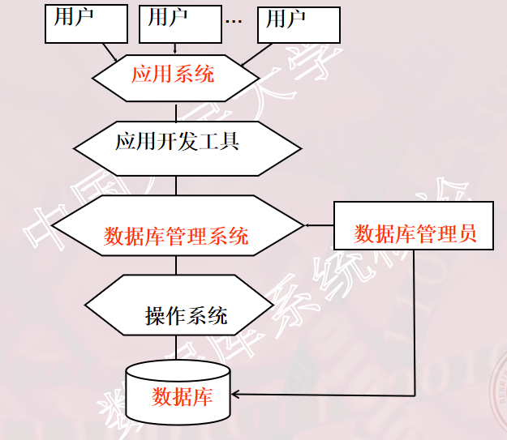

特点：

1. 数据结构化是数据库的主要特征之一

   不再仅仅针对某一应用，面向整个企业或组织。

   不仅数据内部结构化，**整体**是结构化的，数据之间具有联系。

   数据记录可以变长。

   数据的最小存取单位是数据项。

2. 数据的共享性高，冗余度低且易扩充

   数据面向整个系统，可以被多个用户多个应用程序共享使用。

   共享可以减少数据冗余节约存储空间，避免数据之间的不相容性与不一致性，使系统易于扩充。

3. 数据独立性高

   包括物理独立性，指用户的**应用程序**与数据库中**数据**的物理存储时相互独立的。

   以及逻辑独立性，指用户的应用程序与数据库的逻辑结构相互独立。数据结构的改变不影响应用程序。

   数据的独立性有数据管理系统的二级映像功能来保证。

4. **数据由数据库管理系统统一管理和控制**

   数据库管理系统提供数据控制功能。

   1. 数据的安全性保护

      保护数据以防止不合法的使用造成数据泄密。

   2. 数据的完整性检查 

      保证数据的正确性、有效性、和相容性

   3. 并发控制 

      对多用户的并发操作加以控制和协调，防止相互干扰得到错误结果

   4. 数据库恢复 

      将数据库从错误状态恢复到某一已知的正确状态。

##### 1.1.5 数据管理技术的产生和发展

数据管理：是对数据进行分类、组织、编码、存储、检索和维护。是数据处理和数据分析的中心问题。

数据管理技术的发展过程：

人工管理->文件系统->数据库系统

### 1.2 数据模型

数据模型是对现实世界数据特征的抽象。是数据库系统的核心和基础。

数据模型应满足三方面要求，能比较真实地模拟现实世界，且容易为人所理解，便于在计算机上**实现**。

##### 1.2.1 两类数据模型

1. 概念模型   

   也称信息模型，它是按用户的观点来对数据和信息建模，用于数据库设计。

2. 逻辑模型和物理模型   

   逻辑模型主要包括网状模型、层次模型、关系模型、面向对象数据模型、对象关系数据模型、半结构化数据模型等。按计算机系统的观点对数据建模，用于DBMS实现。
   物理模型是对数据**最底层**的抽象，描述数据在系统内部(磁盘)的表示方式和**存取方法**。

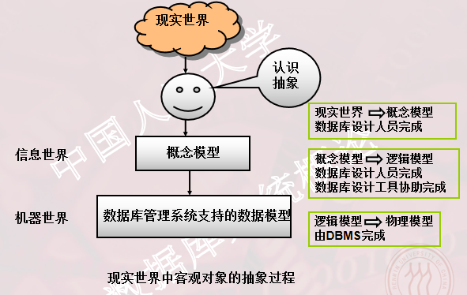

##### 1.2.2 概念模型

概念模型的用途：

1. 概念模型用于信息世界的建模。
2. 是现实世界到机器世界的一个中间层次。
3. 是数据库设计的有力工具。
4. 是数据库设计人员和用户之间进行交流的语言。

对概念模型的基本要求：

1. 较强的语义表达能力。

2. 简单、清晰、**易于用户理解**。

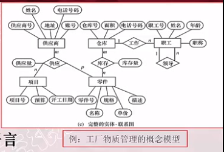

信息世界中的基本概念

1. 实体（Entity）

   客观存在并且可以相互区别的事务称为实体。可以是具体的人、事、物或抽象的概念。

2. 属性（Attribute）

   实体所具有的某一特性称为属性。一个实体可以由若干个属性刻画。

3. 码（Key) 

   唯一标识实体的属性叫做码。

4. 实体型（Entity Type）

   用实体名以及其属性名集合来抽象和刻画同类实体称为实体型。

5. 实体集（Entity Set）

   同一类型实体的集合称为实体集。

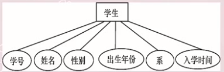

例：某一特定的学生是一个实体，学号，姓名...等是该实体的属性，学号是码，图中抽象的学生概念就是实体型，所有学生的集合就是一个学生的实体集。

6. 联系（Relationship)

   现实世界中事物内部以及事物之间的联系在信息世界
   中反映为实体（型）内部的联系和实体（型）之间的联系。
   实体**内部**的联系：通常是指组成实体的各属性之间的联系。
   实体**之间**的联系：通常是指不同实体集之间的联系，实体之间的联系有一对一、一对多和多对多等多种类型。

概念模型的表示方法：实体-联系方法（Entity-Relationship Approach），用E-R图来描述现实世界的概念模型，E-R方法也称为E-R模型。

##### 1.2.3 数据模型的组成

数据模型是严格定义的一组概念的集合。它精确地描述了系统的静态特性、动态特性和完整性约束条件。

数据模型的组成：

1. 数据结构
   对系统静态特性的描述，往往用**数据结构的类型来命名数据模型**。如层次结构->层次模型，网状结构->网状模型，关系结构->关系模型。

   描述数据库的组成对象，以及对象之间的联系。

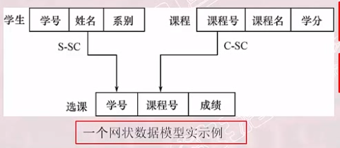

2. 数据操作

   对数据库中各种对象（型）的实例（值）允许执行的操作的集合，包括操作及有关的操作规则。

   数据操作类型：包括查询和更新（插入，删除，修改）。

   数据操作语言：定义数据操作的确切含义、符号、优先级别。查询语言（Query Language)、更新语言DML。

3. 数据的完整性约束条件
   是**一组完整性规则的集合**。

   完整性规则：给定的数据模型中数据及其联系所具有的**制约和依存规则**。
   用以限定符合数据模型的数据库状态以及状态的变化，以保证数据的**正确、有效和相容**。

   **数据模型**对完整性约束条件定义：反映和规定必须遵守的**基本的通用**的完整性约束条件。提供定义完整性约束条件的机制，以反映具体应用所涉及的数据必须遵守的**特定的语义约束条件**。

##### 1.2.4 常用的数据模型

层次模型（Hierarchical Model）
网状模型（Network Model）
**关系模型**（Relational Model)）
面向对象数据模型（Object Oriented Data Model）
对象关系数据模型（Object Relational Data Model）
半结构化数据模型（Semistruture Data Model）
非结构化数据模型，图模型……

层次模型和网状模型统称格式化模型，面向对象数据模型和对象关系数据模型都是对象模型。

格式化模型中数据结构的单位：基本层次联系

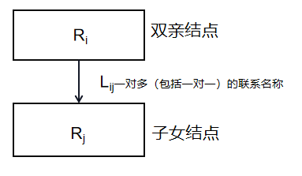

##### 1.2.5 层次模型

层次模型用**树形结构**来表示各类实体以及实体间的**联系** 。

定义： 满足下面两个条件的基本层次联系的集合为层次模型
1. 有且只有一个结点没有双亲结点，这个结点称为**根结点**。
2. 根以外的其它结点**有且只有一个**双亲结点。

表示方法：

​	实体型：用记录类型描述，每个结点表示一个记录类型（实体）

​	属性：用字段描述，每个记录类型可包含若干个字段。

​	联系：用结点之间的连线表示记录类型（实体）之间的**一对多**的	父子联系。

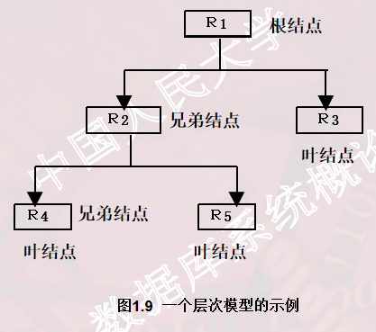

层次模型的特点：

1. 只能直接处理一对多的实体联系。
2. 每个记录类型可以定义一个排序字段，也称为码字段。
3. 任何记录值只能**按其路径**查看。
4. 没有一个子女记录值能够脱离双亲记录值而独立存在。

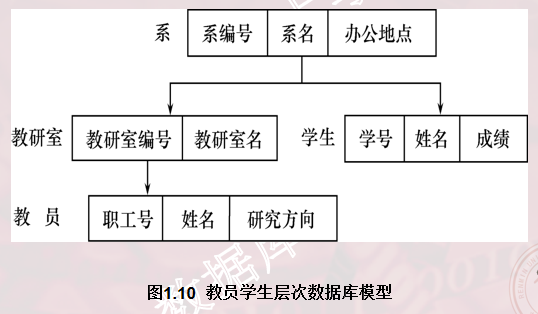

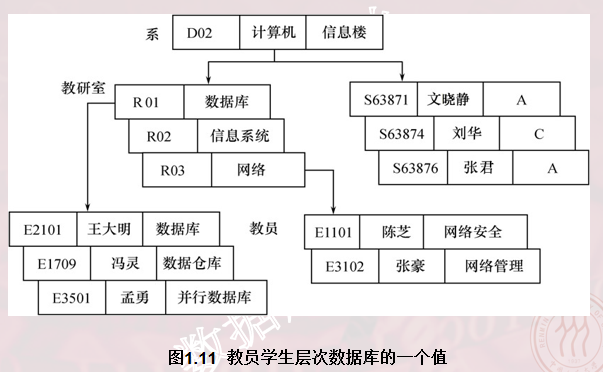

*每个教研室都有一颗子树

层次模型的数据操纵：

查询、插入、删除、更新。

层次模型的完整性约束条件：

无相应的双亲结点值就不能插入子女结点值。
如果删除双亲结点值，则相应的子女结点值也被同时删除。
更新操作时，应更新所有相应记录，以保证数据的一致性。

优点：

层次模型的数据结构比较简单清晰 。
查询效率高，性能优于关系模型，不低于网状模型。
层次数据模型提供了良好的完整性支持。

缺点：

结点之间的多对多联系表示不自然。
对插入和删除操作的限制多，应用程序的编写比较复杂 。
查询子女结点必须通过双亲结点。
层次命令趋于程序化 。

1.2.6 网状模型

网状数据库系统采用网状结构来表示各类实体以及实体间的联系。

定义：满足下面两个条件的基本层次联系的集合

1. 允许一个以上的结点无双亲。

2. 一个结点可以有**多于一个的双亲**。

表示方法：（与层次模型相同）

​	实体型：用记录类型描述，每个结点表示一个记录类型（实体）

​	属性：用字段描述，每个记录类型可包含若干个字段。

​	联系：用结点之间的连线表示记录类型（实体）之间的**一对多**的	父子联系。

网状模型的特点：

1. 允许多个结点没有双亲结点。

2. 允许一个结点有多个双亲结点。

3. 允许两个结点之间有多种联系。

4. 要为每个联系命名，并指出与该联系有关的双亲记录和子女记录。

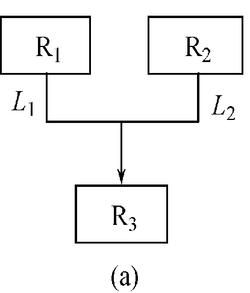

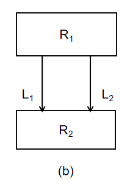

网状模型的例子。（a）中R1，R2都没有双亲结点，R3有两个双亲结点。（b）中R1和R2有两个联系。

多对多联系在网状模型中的表示：

将多对多联系分解为一对多联系。

例：一个学生可以选多门课，一门课程可以被多个学生选修。学生与课程之间是多对多联系。学生选课的网状数据模型如下图：

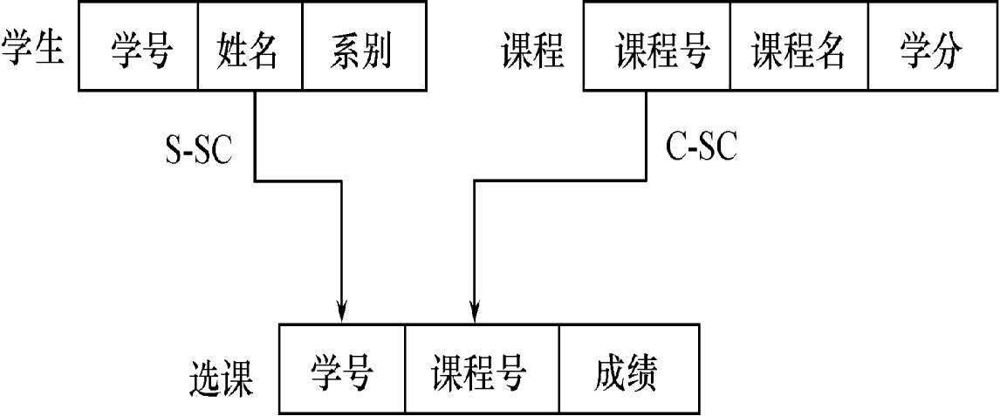

将多对多联系分解为两个一对多联系，S-SC, C-SC。

网状模型的数据操纵：

导航式的查询语言和增删改操作语言。

网状模型的完整性约束条件：

不严格。但实际的网状数据库系统提供了一定的完整性约束。

允许插入尚未确定双亲结点值的子女结点值。

允许只删除双亲结点值。

支持码的概念：唯一标识记录的数据项的集合，取唯一值。

保证一个联系中双亲记录与子女记录之间是一对多的联系。

可以定义双亲记录和子女记录之间某些约束条件。例如：“属籍类别”的概念，要求双亲记录存在才能插入子女记录，双亲记录删除时连同删除子女记录。

优点：
能够更为直接地描述现实世界，如一个结点可以有多个双亲。
具有良好的性能，存取效率较高。

缺点：
结构比较复杂，而且随着应用环境的扩大，数据库的结构就变得越来越复杂，不利于最终用户掌握。
DDL、DML语言复杂，用户不容易使用。
记录之间联系是通过**存取路径**实现的，用户必须了解系统结构的细节。

##### 1.2.7 关系模型

关系数据库采用关系模型作为数据的组织方式。

在用户观点下，关系模型中数据的逻辑结构是一张**二维表**，它由行和列组成。

关系模型的数据结构：

​	关系（Relation）：一个关系对应通常说的一张表。
​	元组（Tuple）：表中的一行即为一个元组。
​	属性（Attribute）：表中的一列即为一个属性，给每一个属性起	一个名称即属性名。
​	主码（Key）：也称码键。表中的某个属性组，它可以唯一确定一	个元组。

​	域（Domain）：是一组具有相同数据类型的值的集合。属性的取	值范围来自某个域。
​	分量：元组中的一个属性值。
​	关系模式：对关系的描述。

关系必须是规范化的，满足一定的规范条件。

最基本的规范条件：关系的每一个分量必须是一个**不可分**的数据项, **不允许表中还有表**。 

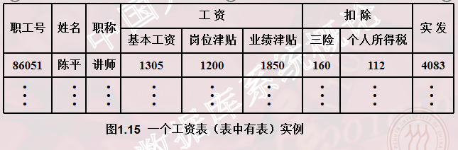

| **关系术语**   | **一般表格的术语**             |
| -------------- | ------------------------------ |
| **关系名**     | **表名**                       |
| **关系模式**   | **表头（表格的描述）**         |
| **关系**       | **（一张）二维表**             |
| **元组**       | **记录或行**                   |
| **属性**       | **列**                         |
| **属性名**     | **列名**                       |
| **属性值**     | **列值**                       |
| **分量**       | **一条记录中的一个列值**       |
| **非规范关系** | **表中有表（大表中嵌有小表）** |

关系模型的数据操纵：

数据操作是集合操作，操作对象和操作结果都是**关系**。查询、插入、删除、更新。

存取路径对用户隐蔽，用户只需要指出找什么，提高了数据独立性，和用户生产率。

关系的完整性约束条件 ：
实体完整性。
参照完整性。
用户定义的完整性。

优点：
建立在严格的数学概念的基础上。
概念单一：实体和各类联系都用关系来表示，对数据的检索结果也是关系。
关系模型的存取路径对用户透明。
具有更高的数据独立性，更好的安全保密性。
简化了程序员的工作和数据库开发建立的工作。

缺点：
存取路径对用户隐蔽，查询效率往往不如格式化数据模型。
为提高性能，必须对用户的查询请求进行优化，增加了开发数据库管理系统的难度。

### 1.3 数据系统的结构

从数据库应用**开发**人员角度看，数据库系统通常采用**三级模式**结构，是数据库系统**内部**的系统结构 。
从数据库最终**用户**角度看，数据库系统的结构分为:
	单用户结构
	主从式结构
	分布式结构
	客户-服务器
	浏览器-应用服务器／数据库服务器多层结构等

##### 1.3.1  数据库系统模式的概念 

模式（Schema）：

是对数据库逻辑结构和特征的描述。是型的描述，不涉及**具体**值,
反映的是数据的结构及其联系，模式是相对稳定的。

实例（Instance）：

**模式的一个具体值**，反映数据库某一时刻的状态，同一个模式可以有很多实例，实例随数据库中的数据的更新而变动。

例：在”学生选课数据库“模式中，包含学生记录、课程记录和学生选课记录。在2014年，2013年都有对应的数据，两年的模式相同，是不同的实例。

##### 1.3.2 数据库系统的三级模式结构

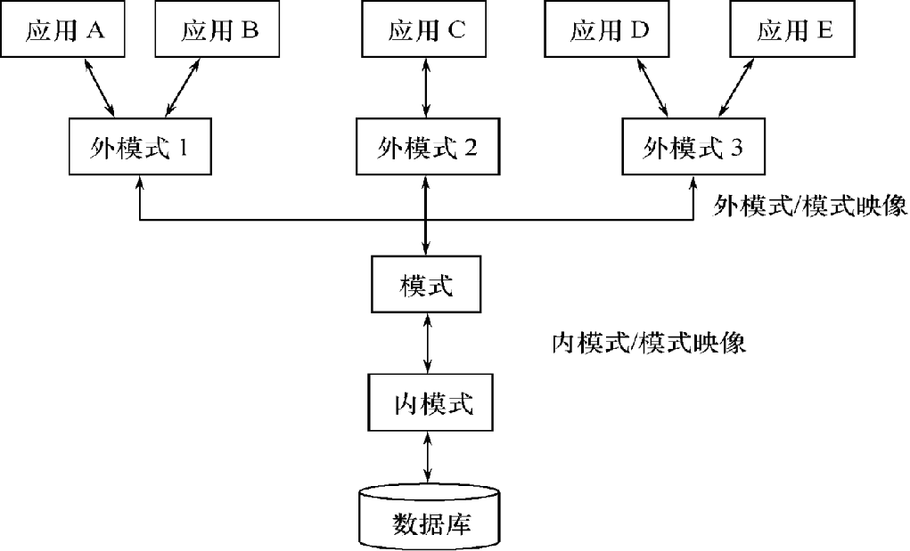

三级模式包括：模式（Schema），外模式（External Schema），内模式（Internal Schema）。

1. 模式（也称逻辑模式）
   数据库中**全体数据**的逻辑结构和特征的描述，所有用户的公共数据视图。
   **一般某个应用的数据库只有一个模式**。
   模式的地位：是数据库系统模式结构的中心，与数据的物理存储细节和硬件环境无关，与具体的应用程序、开发工具及高级程序设计语言无关。

   模式的定义：

   DDL定义数据的逻辑结构、以某种数据模型为基础，数据记录由哪些数据项构成，数据项的名字、类型、取值范围等。

   定义数据之间的联系，与数据有关的安全性、完整性要求。

2. 外模式（也称子模式或用户模式）
   数据库用户（包括应用程序员和最终用户）使用的**局部**数据的逻辑结构和特征的描述，数据库用户的数据视图，是与某一应用有关的数据的逻辑表示。

   外模式与模式的关系：

   外模式通常是模式的**子集**，一个模式可以有多个外模式。反映了不同的用户的应用需求、数据保密的要求。对模式中同一数据，在外模式中的结构、类型、长度、保密级别等都可以不同。

   外模式与应用的关系：
   同一外模式也可以为某一用户的多个应用系统所使用，但一个应用程序只能使用一个外模式。

   外模式的用途：

   是保证数据库安全性的一个有力措施，每个用户只能看见和访问所对应的外模式中的数据。

3. 内模式（也称存储模式）
   是数据**物理**结构和存储方式的描述，是数据在数据库内部的表示方式。
   记录的存储方式（例如，顺序存储，按照B树结构存储，按hash方法存储等）。
   索引的组织方式（B+树，Bitmap,Hash）。
   数据是否压缩存储。
   数据是否加密。
   数据存储记录结构的规定。
   **一个数据库只有一个内模式**。

##### 1.3.3 数据库的二级映像（mapping）功能与数据独立性

数据库的三级模式是对数据的三个抽象级别。

数据管理系统内部提供二级映射：

外模式/模式映像，模式/内模式映像。

通过二级映射实现这三个抽象层次的联系和转换。

1. 外模式/模式映像

   每一个外模式，数据库系统都有一个外模式／模式映象，定义外模式与模式之间的对应关系.映象定义通常包含在**各自外模式的描述中**。

   保证数据的逻辑独立性：
   当**模式改变时**，数据库管理员对外模式／模式映象作相应改变，使**外模式保持不变**。
   **应用程序是依据数据的外模式编写的**，应用程序不必修改，保证了**数据与程序的逻辑独立性**，简称数据的逻辑独立性。

2. 模式／内模式映象

   模式／内模式映象定义了数据全局逻辑结构与存储结构之间的对应关系。例如，说明某个逻辑记录和字段在内部是如何表示的。
   数据库中模式／内模式映象是**唯一**的，该映象定义通常包含在**模式描述**中。

   保证数据的物理独立性：
   当数据库的**存储结构**改变了（例如选用了另一种存储结构），数据库管理员修改模式／内模式映象，使**模式**保持不变。
   应用程序不受影响。保证了数据与程序的物理独立性，简称数据的物理独立性。

优点：

数据库的二级映像保证了数据库外模式的稳定性，从底层保证了应用程序的稳定性，除非应用需求本身发生变化，否则应用程序一般不需要修改 。

具有数据与程序之间的独立性，使得数据的定义和描述可以从应用程序中分离出去 。

数据的存取由数据库管理系统管理，简化了应用程序的编制，大大减少了应用程序的维护和修改 。

### 1.4 数据库系统的组成

组成包括：数据库，数据库管理系统（及其开发工具），应用程序，数据库管理员。

1. 硬件平台以及数据库

   数据库系统对硬件资源的要求：

   足够大的内存，磁盘等外部设备，较高的通道能力，提供数传送率。

2. 软件

   数据库管理系统。
   支持数据库管理系统运行的操作系统。
   与数据库接口的**高级语言及其编译系统**。
   以数据库管理系统为核心的**应用开发工具**。
   为特定应用环境开发的数据库应用系统。

3. 人员

   数据库管理员。
   系统分析员和数据库设计人员。
   应用程序员。
   最终用户。

   不同的人员涉及不同的数据抽象级别，具有不同的数据视图，如下图所示：

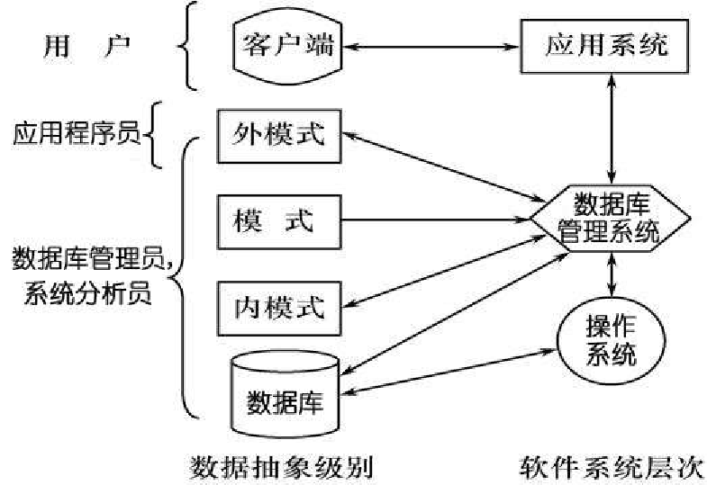

​		DBA具体职责： 

​		决定数据库中的信息内容和结构。

​		决定数据库的存储结构和存取策略。

​		定义数据的安全性要求和完整性约束条件。

​		监控数据库的使用和运行。包括：周期性转储数据库（数据文		件、日志文件）、系统故障恢复、介质故障恢复、监视审计文		件。

​		数据库的改进和重组。包括：性能监控和调优、定期对数据库		进行重组织，以提高系统的性能 需求增加和改变时，数据库须		需要重构造。

​		系统分析员职责：

​		负责应用系统的需求分析和规范说明。

​		与用户及数据库管理员结合，确定系统的硬软件配置。

​		参与数据库系统的概要设计。

​		数据库设计人员职责：

​		参加用户需求调查和系统分析。

​		确定数据库中的数据。

​		设计数据库各级模式。

​		程序员职责：

​		设计和编写应用系统的程序模块。

​		进行调试和安装。

​		用户：

​		是指最终用户（End User）。最终用户通过应用系统的用户接		口使用数据库。包括：偶然用户，简单用户，复杂用户。

​		偶然用户：不经常访问数据库，但每次访问数据库时往往需要		不同的数据库信息 。企业或组织机构的高中级管理人员。

​		简单用户：主要工作是查询和更新数据库 。银行的职员、机票		预定人员、旅馆总台服务员。
​		复杂用户：工程师、科学家、经济学家、科技工作者等。直接		使用数据库语言访问数据库，甚至能够基于数据库管理系统的		应用程序接口编制自己的应用程序。

### 小结

重点：

掌握概念模型的基本概念，以及数据模型的三个组成要素（数据结构，数据操作，数据的完整性约束条件）。

数据库系统的三级模式和两级映像的体系结构。

数据库系统的逻辑独立性和物理逻辑性。

