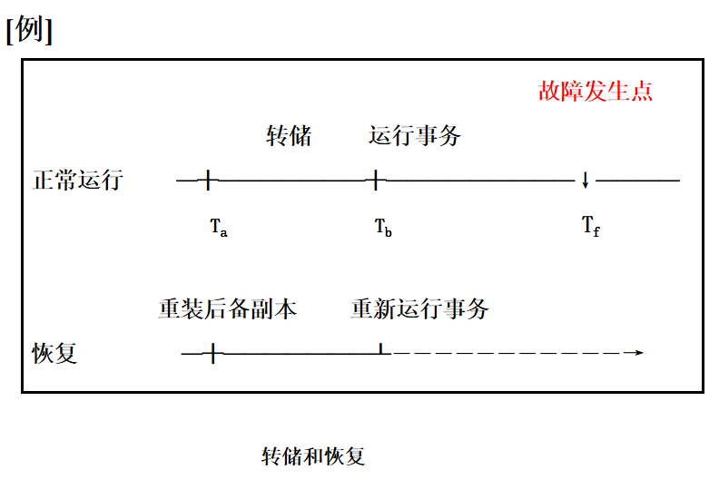
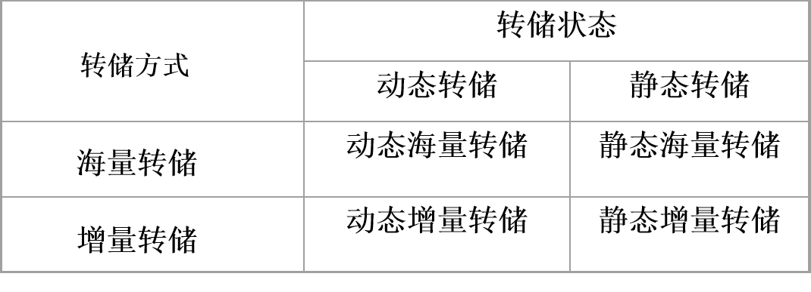
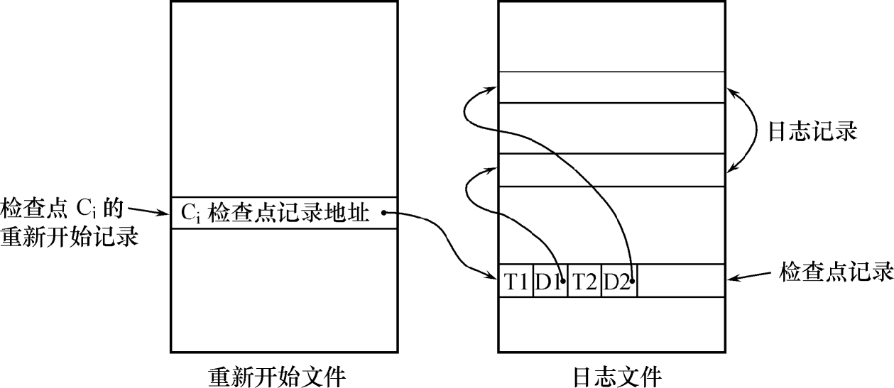
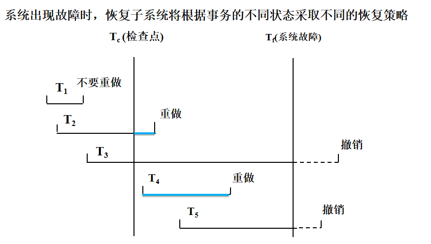
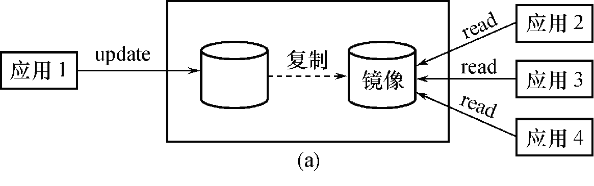
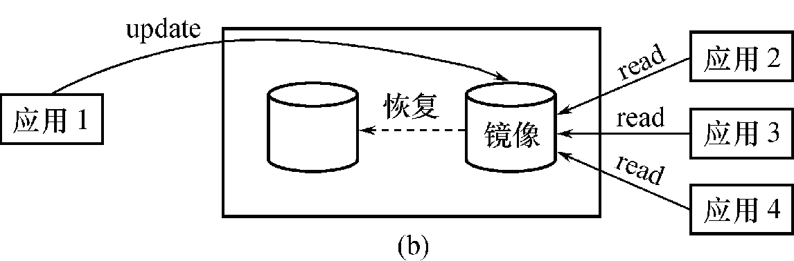
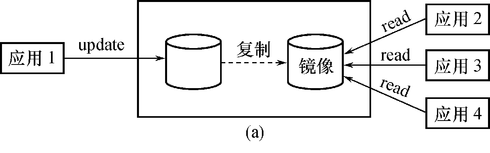

# 10 数据库恢复技术

### 10.1 事务的基本概念

**事务(Transaction)**是用户定义的一个**数据库操作序列**，这些操作要么全做，要么全不做，是一个**不可分割的工作单位**。

事务和程序是两个概念。
在关系数据库中，一个事务可以是一条SQL语句，一组SQL语句或整个程序。一个程序通常包含多个事务。
事务是**恢复和并发控制的基本单位**。

定义事务：

显式定义：

 **BEGIN TRANSACTION**                   **BEGIN TRANSACTION**
          SQL 语句1                                             SQL 语句1
          SQL 语句2                                             SQL 语句2
          。。。。。                                            。。。。。
  **COMMIT**                                           **ROLLBACK**

COMMIT：
事务正常结束。

提交事务的所有操作。

事务中所有对数据库的更新写回到磁盘上的物理数据库中 。

ROLLBACK：
事务异常终止。
事务运行的过程中发生了故障，不能继续执行。
系统将事务中对数据库的所有已完成的操作全部撤销 ，事务**滚回到开始时的状态**。

隐式方式：

当用户没有显式定义事务时，数据库管理系统按缺省规定自动划分事务。比如一条DML语句就是一个事务。

### 10.2 事务的特性（ACID特性）

事务的ACID特性：

1. 原子性（Atomicity）

   事务是数据库的逻辑工作单位，事务中包括的诸操作**要么都做，要么都不做**。

2. 一致性（Consistency）

   事务**执行的结果**必须是使**数据库从一个一致性状态变到另一个一致性状态**。
   一致性状态：
   **数据库中只包含【成功事务】提交的【结果】**。
   不一致状态：
   数据库系统运行中发生故障，有些事务尚未完成就被迫中断；
   这些未完成事务对数据库所做的修改有一部分已写入物理数据库，这时**数据库就处于一种不正确的状态** 。

3. 隔离性（Isolation）

   一个事务的执行**不能被其他事务干扰**。
   一个事务**内部的操作**及使用的**数据**对**其他并发事务是隔离**的
   **并发执行的各个事务之间不能互相干扰**。

4. 持续性（Durability ）

   持续性也称永久性（Permanence）。
   一个事务一旦提交，它对数据库中数据的**改变就应该是永久性的**。接下来的其他操作或故障不应该对其执行结果有任何影响。

保证事务ACID特性是事务处理的任务。
破坏事务ACID特性的因素：

1. 多个事务**并行运行**时，不同事务的操作交叉执行。
   数据库管理系统必须保证多个事务的交叉运行不影响这些事务的隔离性。
2. 事务在运行过程中被**强行停止**。
   数据库管理系统必须保证被强行终止的事务对数据库和其他事务没有任何影响 。

### 10.2  数据库恢复概述

故障是不可避免的：

1. 计算机硬件故障
2. 软件的错误
3. 操作员的失误
4. 恶意的破坏

故障的影响：
运行事务非正常中断，影响数据库中**数据的正确性** 。破坏数据库，全部或部分丢失数据。

数据库的恢复：
数据库管理系统必须具有**把数据库从错误状态恢复到某一已知的正确状态(**亦称为一致状态或完整状态)的功能，这就是数据库的恢复管理系统对故障的对策。
**恢复子系统是数据库管理系统的一个重要组成部分**。 
恢复技术是衡量系统优劣的重要指标。

### 10.3 故障种类

1. 事务内部的故障
2. 系统故障
3. 介质故障
4. 计算机病毒

##### 10.3.1 事务内部的故障

事务内部的故障有的是可以**通过事务程序本身发现**的(见下面转账事 务的例子)。有的是**非预期的，不能由事务程序处理的**。 

例如，银行转账事务，这个事务把一笔金额从一个账户甲转给另一个账户乙。

```
     BEGIN TRANSACTION
    	      读账户甲的余额BALANCE;
           BALANCE=BALANCE-AMOUNT;    /*AMOUNT 为转账金额*/
           IF(BALANCE < 0 ) THEN
                 {打印‘金额不足，不能转账’；	                                         /*事务内部可能造成事务被回滚的情况*/
                  ROLLBACK;                        /*撤销刚才的修改，恢复事务*/ 
                 }
           ELSE
                 {读账户乙的余额BALANCE1;
                   BALANCE1=BALANCE1+AMOUNT;
                   写回BALANCE1;
                   COMMIT;}

```

这个例子所包括的两个更新操作要么全部完成要么全部不做。否则就会使数据库处于不一致状态，例如只把账户甲的余额减少了而没有把账户乙的余额增加。
在这段程序中若产生账户甲余额不足的情况，应用程序可以发现并让事务滚回，撤销已作的修改，恢复数据库到正确状态。

**事务内部更多的故障是非预期的，是不能由应用程序处理的**。
如：运算溢出，并发事务发生**死锁而被选中撤销该事务**，违反了某些完整性限制而被终止等。
以后，**事务故障仅指这类非预期的故障**。

**事务故障**意味着事务没有达到预期的终点(COMMIT或者显式的ROLLBACK)。**数据库可能处于不正确状态**。 
事务故障的恢复：**事务撤消（UNDO）**
**强行回滚（ROLLBACK）该事务**，撤销该事务已经作出的任何对数据库的修改，使得该事务象根本没有启动一样。

##### 10.3.2 系统故障

系统故障：称为软故障，**是指造成系统停止运转的任何事件**，使得
系统要**重新启动**。 

系统故障的影响：

1. 整个系统的正常运行突然被破坏。
2. **所有**正在运行的事务都非正常终止。
3. 不破坏数据库，**内存中数据库缓冲区**的信息全部丢失。部分已完成事务更新后的数据还在缓冲区，没有来得及刷新到硬盘上，这些更新就丢失了。

系统故障的常见原因：

1. 特定类型的硬件错误（如CPU故障）。
2. 操作系统故障。
3. 数据库管理系统代码错误。
4. 系统断电。

系统故障的恢复：

发生系统故障时，一些尚**未完成的事务的结果**可能已送入物理数据库，造成数据库**可能处于不正确状态**。 

恢复策略：系统重新启动时，恢复程序**让所有非正常终止的事务回滚**，强行撤消（UNDO）所有未完成事务。

发生系统故障时，有些已完成的事务可能有一部分甚至全部留在缓**冲区**，尚未写回到磁盘上的物理数据库中，系统故障使得这些事务对数据库的**修改部分或全部丢失**。

恢复策略：系统重新启动时，恢复程序需要**重做（REDO）所有已提交的事务**。

系统故障恢复需要做两件事：

1. 撤销所有未完成的事务。
2. 重做所有已提交的事务。

##### 10.3.3 介质故障

介质故障：称为硬故障，指**外存故障**。
包括：磁盘损坏，磁头碰撞，瞬时强磁场干扰。
介质故障**破坏数据库或部分数据库**，并影响正在存取这**部分数据的所有事务** 。介质故障比前两类故障的可能性小得多，但**破坏性大得多**。

需要对数据库文件做备份，通过备份文件恢复。

##### 10.3.4 计算机病毒

计算机病毒：
一种人为的故障或破坏，是一些恶作剧者研制的一种计算机程序可以繁殖和传播，造成对计算机系统包括数据库的危害。
计算机病毒已成为计算机系统的主要威胁，自然也是数据库系统的主要威胁 。
数据库一旦被破坏仍要用恢复技术把数据库加以恢复。

##### 10.3.5 故障小结

各类故障，对数据库的影响有两种可能性：

1. 是数据库本身被破坏。
2. 是数据库没有被破坏，但数据可能不正确，这是由于事务的运行被非正常终止造成的。

恢复操作的基本原理：冗余
利用存储在系统别处的**冗余数据**来重建数据库中已被破坏或不正确的那部分数据。
恢复的实现技术：复杂
一个大型数据库产品，恢复子系统的代码要占全部代码的10%以上。

### 10.4  恢复的实现技术

恢复机制涉及的关键问题：
1. **如何建立冗余数据**。
数据转储（backup）
登记日志文件（logging）
2. 如何**利用**这些**冗余数据实施数据库恢复**。

##### 10.4.1  数据转储

数据转储：是指**数据库管理员定期**地将**整个数据库复制**到磁带、磁盘或**其他存储介质上保存**起来的过程。

备用的数据文本称为**后备副本(backup)或后援副本**。

数据库遭到破坏后可以将后备副本重新装入。**重装后备副本只能将数据库恢复到转储时的状态**，要想**恢复到故障发生时**的状态，必须**重新运行自转储以后的所有更新事务**。

 

上图中：
系统在Ta时刻**停止运行事务**，进行数据库转储。
在Tb时刻转储完毕，得到Tb时刻的数据库一致性副本。
系统运行到Tf时刻发生故障，为恢复数据库，首先由数据库管理员重装数据库后备副本，将数据库**恢复至Tb时刻的状态**。
重新运行自Tb～Tf时刻的所有更新事务，把数据库恢复到故障发生前的一致状态。

**转储方法**：

1. 从数据库的**状态**分为：静态转储与动态转储

   静态转储：
   在系统中**无运行事务时进行的转储操作**。
   转储**开始时数据库处于一致性状态**。
   转储期间**不允许**对数据库的**任何存取、修改活动**。
   得到的**一定是一个数据一致性的副本** 。
   优点：实现简单。
   缺点：降低了数据库的可用性。转储必须等待正运行的用户事务结束 。**新的事务必须等转储结束**。

   适用于不需要24小时不间断服务的数据库。

   

   动态转储：
   **转储操作与用户事务并发进行**。
   转储期间**允许对数据库进行存取或修改**。
   优点：
   不用等待正在运行的用户事务结束。
   不会影响新事务的运行。
   缺点：
   **不能保证副本中的数据正确有效**。
   例在转储期间的某时刻Tc，系统把数据A=100转储到磁带上，而在下一时刻Td，某一事务将A改为200。后备副本上的A过时了

   故障恢复：
   需要把**动态转储期间各事务对数据库的修改活动登记下来**，建立**日志文件**。
   **后备副本加上日志文件**就能把数据库恢复到**某一时刻的正确状态**。

2. 从转储方式分为：海量转储与增量转储

   海量转储: 每次转储全部数据库。
   增量转储: 只转储上次转储后**更新过的数据**。

   海量转储与增量转储比较：
   从恢复角度看，使用海量转储得到的后备副本进行恢复往往更方便。如果数据库很大，事务处理又十分频繁，则增量转储方式更实用更有效。

    

DBA通常会根据数据库的使用情况，确定一个适当的转储周期，并配合使用这4类方法。

##### 10.4.2  登记日志文件

1. 日志文件的格式和内容
2. 日志文件的作用
3. 登记日志文件

什么是日志文件：
日志文件(log file)是用来**记录事务对数据库的更新操作的文件**。

日志文件的格式：
以**记录为单位**的日志文件。
以**数据块为单位**的日志文件。

以**记录为单位**的日志文件内容：

1. 各个事务的开始标记(BEGIN TRANSACTION)
2. 各个事务的结束标记(COMMIT或ROLLBACK)
3. 各个事务的所有更新操作
4. 以上均作为日志文件中的一个日志记录 (log  record)

以记录为单位的日志文件，**每条日志记录**的内容：

1. 事务标识（标明是哪个事务） 

2. 操作类型（插入、删除或修改）

3. 操作对象（记录ID、Block NO.）

4. 更新前数据的**旧值**（对插入操作而言，此项为空值）

5. 更新后数据的**新值**（对删除操作而言, 此项为空值）

   例： T1 U AA 18 20，表示事务T1修改了对象AA的值，修改前18，修改后20。T1 I TU 1，表示表示事务T1插入元组TU，TU的值为1。

以**数据块为单位**的日志文件，每条日志记录的内容：

1. 事务标识
2. 被更新的数据块

日志文件的作用：

1. 进行事务故障恢复。
2. 进行系统故障恢复。
3. 协助后备副本进行介质故障恢复。

具体作用：

1. **事务故障恢复和系统故障恢复必须用日志文件**。
2. 在**动态转储方式中必须建立日志文件**，后备副本和日志文件结合起来才能有效地恢复数据库。
3. 在静态转储方式中，也可以建立日志文件。
   当数据库毁坏后可重新装入后援副本把数据库恢复到转储结束时刻的正确状态。利用日志文件，把**已完成的事务进行重做处理**
   **对故障发生时尚未完成的事务进行撤销处理**。
   **不必重新运行那些已完成的事务程序**就可把数据库恢复到故障前某一时刻的正确状态 。

登记日志文件：

为保证数据库是可恢复的，**登记日志文件**时必须遵循两条原则：

1. 登记的**次序**严格按**并发事务执行的时间**次序。
2. 必须**先写日志文件**，**后写数据库**。
   写日志文件操作：把表示这个修改的日志记录写到日志文件中。
   写数据库操作：把对数据的修改写到数据库中。

为什么要先写日志文件：
写数据库和写日志文件是两个不同的操作。
在这两个操作之间可能发生故障。如果先写了数据库修改，而在日志文件中**没有登记下这个修改**，则以后就**无法恢复这个修改**了。
如果先写日志，但没有修改数据库，按日志文件恢复时只不过是多执行一次不必要的UNDO操作，并**不会影响数据库的正确性**。

### 10.5 恢复策略

##### 10.5.1  事务故障的恢复

事务故障：事务在运行至正常终止点前被终止。
恢复方法：
由恢复子系统利用**日志文件撤消（UNDO）**此事务已对数据库进行的修改。**事务故障的恢复由系统自动完成**，对用户是透明的，不需要用户干预。

事务故障的恢复步骤：

1. 反向扫描文件日志（即**从最后向前**扫描日志文件），查找该事务的**更新操作**。
2. 对该事务的更新操作执行逆操作。即将**日志记录中“更新前的值” 写入数据库**。
   插入操作， “更新前的值”为空，则相当于做删除操作。
   删除操作，“更新后的值”为空，则相当于做插入操作。
   若是修改操作，则相当于用修改前值代替修改后值 。
3. 继续反向扫描日志文件，查找该事务的其他更新操作，并做同样处理。
4. 如此处理下去，**直至**读到此**事务的开始标记**，事务故障恢复就完成了。

##### 10.5.2  系统故障的恢复

系统故障造成数据库不一致状态的原因：

1. **未完成事务**对数据库的更新可能**已写入数据库**。
2. **已提交事务**对数据库的更新可能还留在缓冲区**没来得及写入数据库**。

恢复方法：

1. **Undo** 故障发生时**未完成**的事务
2.  **Redo 已完成**的事务

系统故障的恢复由系统在重新启动时自动完成，不需要用户干预。

系统故障的恢复步骤：

1. **正向扫描**日志文件（即从头扫描日志文件）
   **重做(REDO) 队列**: 在故障发生前已经提交的事务。
   这些事务既有**BEGIN TRANSACTION记录，也有COMMIT**记录。
   **撤销 (UNDO)队列**:故障发生时尚未完成的事务。
    这些事务**只有BEGIN TRANSACTION记录，无**相应的COMMIT记录。

   在一遍扫描中得到两个上述队列，遇到BEGIN TRANSACTION记录就加入UNDO队列，遇到COMMIT记录就从UNDO->REDO。

2. 对撤销(UNDO)队列事务进行**撤销(UNDO)处理**
   **反向扫描日志文件**，对每个撤销事务的更新操作执行逆操作，即将日志记录中“**更新前**的值”**写入数据库** 。
3. 对重做(REDO)队列事务进行**重做(REDO)处理**
   **正向扫描日志文件**，对每个重做事务重新执行登记的操作，即将日志记录中“**更新后**的值”**写入数据库** 。

系统故障恢复需要扫描三次日志文件，第一次建立UNDO,REDO队列。第二遍做UNDO操作，第三遍做REDO操作。

##### 10.5.3  介质故障的恢复

介质故障的恢复：

1. 重装数据库

   装入最新的后备数据库副本(**离故障发生时刻最近的转储副本**) ，使数据库恢复到最近一次转储时的一致性状态。
   对于静态转储的数据库副本，装入后数据库即处于一致性状态。
   对于**动态转储**的数据库副本，还须**同时装入转储时刻的日志文件副本**，**利用恢复系统故障的方法**（即REDO+UNDO），才能将数据库恢复到一致性状态。

2. 重做已完成的事务

   装入有关的日志文件副本(转储**结束时刻的日志文件副本**) ，重做已完成的事务。
   首先扫描日志文件，找出**故障发生时已提交的事务的标识**，将其记入**重做队列**。然后正向扫描日志文件，对重做队列中的所有事务进行重做处理。即将日志记录中“**更新后**的值”写入数据库。

介质故障的恢复需要数据库管理员介入。

##### 10.5.4 小结

事务故障的恢复：UNDO；

系统故障的恢复：UNDO+REDO；

介质故障的恢复：重装后援副本+REDO。

### 10.6  具有检查点的恢复技术

为什么要引入检查点（针对于系统故障的低效问题）：

1. 搜索整个日志将耗费大量时间。比如，系统故障恢复要扫描三次文件。
2. 重做处理：重新执行，浪费大量时间。

具有检查点（checkpoint）的恢复技术：

1. **日志文件**中增加**检查点记录（checkpoint）**。增加了时间点后，就可以从某个时间点的记录开始读取，或者重新执行，以节省时间。

2. 增加重新开始文件。
3. **恢复子系统**在登录日志文件期间**动态地维护日志**。

检查点技术：

1. 检查点记录的内容
   建立**检查点时刻**所有**正在执行的事务清单**，以及这些事务**最近一个日志记录的地址**。

   除了在事务清单上的事务，其他的事务均已完成。日志记录的地址方便快速找到这些事务的日志（链表的头指针，顺着这个指针就能一次找到事务的日志，逆序，是执行撤销操作的顺序）。

2. 重新开始文件的内容

   记录各个**检查点**记录**在日志文件中的地址**。

   也就是说通过重新开始文件，系统不需要重新扫描日志文件，就能获取检查点的记录。 重新开始文件记录了检查点Ci的记录在日志文件的位置，从日志文件可知，Ci时刻有T1，T2正在运行，T1最近的日志记录地址在D1，T2最近的日志记录地址在D2。

3. 动态维护日志文件的方法

   周期性地执行如下操作：建立检查点，保存数据库状态。
   具体步骤是：

   1. 将当前**日志缓冲区**中的**所有日志记录写入磁盘的日志文件上**
   2. 在日志文件中**写入一个检查点记录**。
   3. 将当前**数据缓冲区**的所有**数据记录写入**磁盘的数据库中。
   4. 把检查点记录在日志文件中的地址写入一个重新开始文件。

恢复子系统可以定期或不定期地建立检查点,保存数据库状态 
定期：按照预定的一个时间间隔，如每隔一小时建立一个检查点 。
不定期：按照某种规则，如日志文件已写满一半建立一个检查点。

使用检查点方法可以改善恢复效率：
当事务T在一个**检查点之前提交**，T对数据库所做的修改已写入数据库。写入时间是在这个检查点建立**之前**或在这个检查点建立**之时** 。在进行恢复处理时，没有必要对事务T执行重做操作。

 

T1：在检查点之前提交，一定已被写入日志和数据库。
T2：在检查点之前开始执行，在检查点之后故障点之前提交，需要从		Tc之后开始重做。因为Tc时刻以及把当前时刻的日志和数据写入		了。
T3：在检查点之前开始执行，在故障点时还未完成，需要撤销。
T4：在检查点之后开始执行，在故障点之前提交，全部需要重做，因		为可能相关数据在缓存中没有写入磁盘。
T5：在检查点之后开始执行，在故障点时还未完成，需要撤销。

利用检查点的恢复步骤：

1. 从**重新开始文件**中找到**最后一个检查点记录**在日志文件中的**地址**，由该地址在日志文件中找到最后一个检查点记录。
2. 由该检查点记录得到检查点建立时刻**所有正在执行的事务清单ACTIVE-LIST**。
   建立两个事务队列：
   UNDO-LIST ，REDO-LIST 。
   把ACTIVE-LIST暂时放入UNDO-LIST队列，REDO队列暂为空。

3. 从**检查点开始正向扫描日志文件**，**直到日志文件结束**。
   如有新**开始**的事务Ti，把Ti暂时**放入UNDO-LIST**队列；如有**提交**的事务Tj，把Tj从UNDO-LIST队列**移到REDO-LIST**队列;直到日志文件结束。
4. 对UNDO-LIST中的每个事务执行UNDO操作。
   对REDO-LIST中的每个事务执行REDO操作。

### 10.7  数据库镜像

介质故障是对系统影响**最为严重的一种故障**，严重影响数据库的可用性。
介质故障恢复比较费时。
为预防介质故障，数据库管理员必须周期性地转储数据库。
提高数据库可用性的解决方案：**数据库镜像（Mirror）**。

数据库镜像：

1. **数据库管理系统自动**把**整个数据库或其中的关键数据复制到另一个磁盘上**。
2. 数据库管理系统**自动保证镜像数据与主数据的一致性**。
   每当主数据库更新时，数据库管理系统自动把更新后的数据复制过去。

 

出现介质故障时：

1. 可由镜像磁盘继续提供使用。 

2. 同时数据库管理系统**自动利用镜像磁盘数据进行数据库的恢复**
   不需要关闭系统和重装数据库副本。

    

没有出现故障时：

1. 可用于**并发操作**。
   一个用户对数据加排他锁修改数据，其他用户**可以读镜像数据库上的数据，而不必等待该用户释放锁**。

    

频繁地复制数据自然**会降低系统运行效率**。
在实际应用中用户往往只选择对**关键数据和日志文件镜像**，不是对整个数据库进行镜像。

### 10.8  小结

事务的概念和性质。
事务是数据库的逻辑工作单位。
数据库管理系统保证系统中一切事务的原子性、一致性、隔离性和持续性，就保证了事务处于一致状态。

故障的种类：事务故障，系统故障，介质故障。
恢复中最经常使用的技术：数据库转储，登记日志文件。

恢复的基本原理：
利用存储在后备副本、日志文件和数据库镜像中的冗余数据来重建数据库。
事务不仅是**恢复的基本单位**，也是并发控制的基本单位。

目标：

掌握事务的基本概念。

掌握数据库运行中可能产生的故障类型以及恢复技术。

重点：

牢固掌握事务的性质。数据库恢复的实现技术。具有检查点的恢复技术。