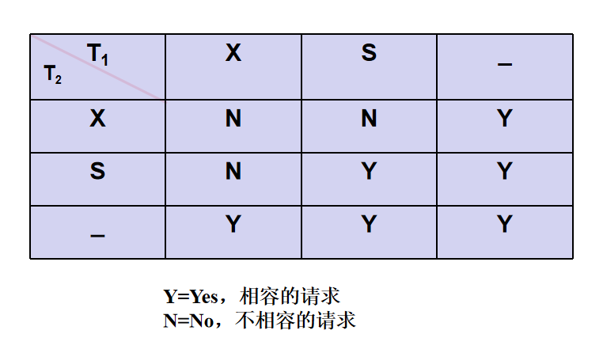
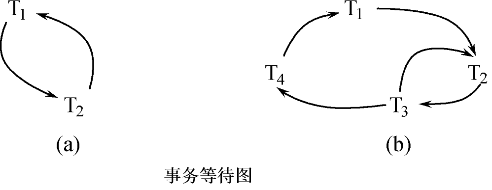

# 11 并发控制

多用户数据库系统，允许多个用户同时使用的数据库系统，在同一时刻并发运行的事务数可达数百上千个。如飞机定票数据库系统，银行数据库系统 。

多事务执行方式 ：

1. 事务串行执行
   **每个时刻只有一个事务运行**，其他事务必须等到这个事务结束以后方能运行
   **不能充分利用系统资源**，发挥数据库共享资源的特点。

2. 交叉并发方式（Interleaved  Concurrency）

   在**单处理机**系统中，事务的并行执行是这些并行事务的并行操作**轮流交叉运行**
   单处理机系统中的并行事务并**没有真正地并行运行**，**但能够减少处理机的空闲时间**，提高系统的效率。

    

3. 同时并发方式（simultaneous  concurrency）
   **多处理机**系统中，**每个处理机可以运行一个事务**，多个处理机可以同时运行多个事务，实现多个事务真正的并行运行。是最理想的并发方式，但受制于硬件环境。

*本章讨论的数据库系统并发控制技术是以**单处理机系统**为基础的。

事务并发执行带来的问题：

1. 会产生多个事务同时存取同一数据的情况 。
2. 可能会存取和存储不正确的数据，破坏事务**隔离性**和数据库的**一致性** 。

数据库管理系统必须提供并发控制机制，并发控制机制是衡量一个数据库管理系统性能的重要标志之一。

### 11.1  并发控制概述

**事务是并发控制的基本单位**。
并发控制机制的任务：

1. 对并发操作进行正确调度。
2. 保证事务的隔离性。
3. 保证数据库的一致性。

并发操作带来数据的不一致性实例：
[例11.1]飞机订票系统中的一个活动序列 
① 甲售票点(事务T1)读出某航班的机票余额A，设A=16；
② 乙售票点(事务T2)读出同一航班的机票余额A，也为16；
③ 甲售票点卖出一张机票，修改余额A←A-1，所以A为15，把A写回数据库；
④ 乙售票点也卖出一张机票，修改余额A←A-1，所以A为15，把A写回数据库 
结果明明卖出两张机票，数据库中机票余额只减少1 。

这种情况称为数据库的不一致性，是由并发操作引起的。
在并发操作情况下，对T1、T2两个事务的操作序列的调度是随机的。
若按上面的调度序列执行，T1事务的修改就被丢失。
原因：第4步中T2事务修改A并写回后覆盖了T1事务的修改。

并发操作带来的数据不一致性

1. 丢失修改（Lost Update）
2. 不可重复读（Non-repeatable Read）
3. 读“脏”数据（Dirty Read）

记号：

​	R(x):读数据x
​	W(x):写数据x 

##### 11.1.1 丢失修改

两个事务T1和T2读入同一数据并修改，T2的提交结果破坏了T1提交的结果，导致T1的**修改被丢失**。
 

##### 11.1.2 不可重复读

不可重复读是指事务T1读取数据后，事务T2执行更新操作，使**T1无法再现前一次读取结果**。

不可重复读包括三种情况：

1. 事务T1读取某一数据后，事务T2对其做了修改，当事务T1再次读该数据时，得到与前一次不同的值。

 

2. 事务T1按一定条件从数据库中读取了某些数据记录后，事务T2**删除**了其中部分记录，当T1再次按相同条件读取数据时，发现某些记录神秘地**消失**了。 

3. 事务T1按一定条件从数据库中读取某些数据记录后，事务T2**插入**了一些记录，当T1再次按相同条件读取数据时，发现**多**了一些记录。

   后两种不可重复读有时也称为**幻影现象**（Phantom Row）

##### 11.1.3 脏读

读“脏”数据是指：

事务T1修改某一数据，并将其写回磁盘。事务T2读取同一数据后，T1由于某种原因被**撤销**。这时T1已修改过的数据恢复原值，T2读到的数据就与数据库中的数据不一致。T2读到的数据就为“脏”数据，即不正确的数据 。

简单来说，脏读是读到了**其他事务未提交的数据**。未提交意味着可能回滚，最终不一定存到数据库中，也就是读到了**不正确**的**最终不存在**的数据。

 

##### 11.1.4 并发控制

数据不一致性：由于**并发操作破坏了事务的隔离性**。
**并发控制就是要用正确的方式调度并发操作**，使一个用户事务的执行不受其他事务的干扰，从而避免造成数据的不一致性 。对数据库的应用有时允许某些不一致性，例如有些统计工作涉及数据量很大，读到一些“脏”数据对统计精度没什么影响，可以降低对一致性的要求以减少系统开销 。

并发控制的主要技术：

1. **封锁(Locking)**
2. 时间戳(Timestamp)
3. 乐观控制法
4. **多版本并发控制(MVCC)**

### 11.2 封锁

封锁就是**事务T**在对某个**数据对象（例如表、记录等）操作之前**，先向系统发出请求，对其加锁。
加锁后事务T就对该数据对象有了一定的控制，在事务T释放它的锁之前，其它的事务不能更新此数据对象。
封锁是实现并发控制的一个非常重要的技术。

一个事务对某个数据对象加锁后究竟拥有什么样的控制由封锁的类型决定。

基本封锁类型：

1. 排它锁（Exclusive Locks，简记为**X锁**/写锁）
2. 共享锁（Share Locks，简记为**S锁**/读锁）

X锁：

若事务T对数据对象A加上**X锁**，则**只允许T读取和修改A**，其它任何事务都**不能再对A加任何类型的锁**，直到T释放A上的锁。

保证其他事务在T释放A上的锁之前不能再**读取和修改**A 。

S锁：

若事务T对数据对象A加上S锁，则**事务T可以读A但不能修改A**，其它事务**只能再对A加S锁**，而不能加X锁，直到T释放A上的S锁。
保证**其他事务可以读A**，但在T释放A上的S锁之前**不能对A做任何修改** 。

 

在锁的相容矩阵中：
最左边一列表示事务T1已经获得的数据对象上的锁的类型，其中横线表示没有加锁。
最上面一行表示另一事务T2对同一数据对象发出的封锁请求。
T2的封锁请求能否被满足用矩阵中的Y和N表示。

### 11.3 封锁协议

封锁协议：
在运用X锁和S锁对数据对象加锁时，需要**约定一些规则**，这些规则为封锁协议（Locking Protocol）。 包括：**何时申请**X锁或S锁，**持锁时间**，**何时释放**。
对封锁方式规定不同的规则，就形成了各种不同的封锁协议，它们分别在不同的程度上为并发操作的正确调度提供一定的保证。

三级封锁协议：

1. 一级封锁协议
2. 二级封锁协议
3. 三级封锁协议

##### 11.3.1 一级封锁协议

事务T在**修改数据R之前**必须先对其**加X锁**，直到**事务结束**才**释放**。正常结束（COMMIT）或非正常结束（ROLLBACK）。

**一级封锁协议可防止丢失修改**，并保证事务T是可恢复的。
在一级封锁协议中，如果仅仅是读数据不对其进行修改，是不需要加锁的，所以它**不能保证可重复读和不读“脏”数据**。

 

##### 11.3.2 二级封锁协议

一级封锁协议加上事务T在**读取数据**R之前必须先对其加**S锁**，**读完后即可释放S锁**。

二级封锁协议可以**防止丢失修改和读“脏”数据**。
在二级封锁协议中，由于读完数据后即可释放S锁，所以它**不能保证可重复读**。

 

##### 11.3.3 三级封锁协议

一级封锁协议加上事务T在**读取数据**R之前必须先对其加**S锁**，直到**事务结束才释放**。

三级封锁协议可防止**丢失修改、读脏数据和不可重复读**。

 

##### 11.3.4 小结

三级协议的主要区别：什么**操作**需要申请封锁以及**何时释放**锁（即持锁时间）。
不同的封锁协议使事务达到的一致性级别不同，封锁协议级别越高，一致性程度越高。

 

### 11.4  活锁和死锁

封锁技术可以有效地解决并行操作的一致性问题，但也带来一些新的问题：死锁，活锁。

##### 11.4.1 活锁

 

事务T1封锁了数据R，事务T2又请求封锁R，于是T2等待。
T3也请求封锁R，当T1释放了R上的封锁之后系统首先批准了T3的请求，T2仍然等待。
T4又请求封锁R，当T3释放了R上的封锁之后系统又批准了T4的请求……T2有可能**永远等待**，这就是活锁的情形。

避免活锁：采用先来先服务的策略
当多个事务请求封锁同一数据对象时，按请求封锁的**先后次序对这些事务排队**，该数据对象上的锁一旦释放，首先批准申请队列中第一个事务获得锁。

##### 11.4.2  死锁

 

事务T1封锁了数据R1，T2封锁了数据R2。
T1又请求封锁R2，因T2已封锁了R2，于是T1等待T2释放R2上的锁
接着T2又申请封锁R1，因T1已封锁了R1，T2也只能等待T1释放R1上的锁。这样T1在等待T2，而T2又在等待T1，T1和T2两个事务永远不能结束，形成死锁 。

**两（多）个事务相互封锁了对方的事务中需要上锁的数据，导致事务永远不能结束。**

解决死锁的方法：

1. 死锁的预防
2.  死锁的诊断与解除

死锁的预防：

产生死锁的原因是两个或多个事务都已封锁了一些数据对象，然后又都请求对已为其他事务封锁的数据对象加锁，从而出现死等待。
**预防死锁的发生就是要破坏产生死锁的条件**。

预防死锁的方法：

1. 一次封锁法

   要求每个事务必须**一次将所有要使用的数据全部加锁**，否则就不能继续执行。
   存在的问题：
   过早加锁，降低系统并发度。

   难于事先精确确定封锁对象：
   		数据库中数据是不断变化的，**原来不要求封锁的数据，在执行过程中可能会变成封锁对象**，所以很难事先精确地确定每个事务所要封锁的数据对象。
   		解决方法：将事务在执行过程中**可能要封锁的数据对象全部加锁，这就进一步降低了并发度**。

2. 顺序封锁法

   顺序封锁法是预先对数据对象**规定一个封锁顺序**，**所有事务都按这个顺序实行封锁**。

   顺序封锁法存在的问题：
   	维护成本
       数据库系统中**封锁的数据对象极多**，并且随数据的插入、删除等操作而不断地变化，要维护这样的资源的封锁顺序非常困难，成本很高。
   	难以实现
       事务的封锁请求可以随着事务的执行而动态地决定，**很难事先确定每一个事务要封锁哪些对象**，因此也就**很难按规定的顺序去施加封锁** 。

结论：
在操作系统中广为采用的预防死锁的策略并不太适合数据库的特点
数据库管理系统在解决死锁的问题上更**普遍采用的是诊断并解除死锁的方法**。

死锁的诊断：

1. 超时法

   如果一个事务的**等待时间超过了规定的时限**，就认为发生了死锁。
   优点：实现简单
   缺点：有可能**误判**死锁，时限若设置得太长，死锁发生后不能及时发现。

2. 等待图法 

   用**事务等待图**动态反映所有事务的等待情况。
   事务等待图是一个**有向图G=(T，U)**。
   T为结点的集合，每个结点**表示正运行的事务**。
   U为边的集合，每条边**表示事务等待的情况**。
   若T1等待T2，则T1，T2之间划一条有向边，从T1指向T2。

    

   图(a)中，事务T1等待T2，T2等待T1，产生了死锁.
   图(b)中，事务T1等待T2，T2等待T3，T3等待T4，T4又等待T1，产生了死锁 。图(b)中，事务T3可能还等待T2，在大回路中又有小的回路 。

   并发控制子系统**周期性地（比如每隔数秒）生成事务等待图**，检测事务。如果发现**图中存在回路**，则表示系统中出现了死锁。

解除死锁：
	选择一个处理死锁**代价最小的事务**，将其撤消。**释放此事务持有的所有的锁，使其它事务能继续运行下去**。撤销对应删除事务等待图的一个节点，以及和它相连的边。

### 11.5  并发调度的可串行性

数据库管理系统对**并发事务不同的调度可能会产生不同的结果**。
什么样的调度是正确的？

串行调度是正确的。
执行结果**等价于串行调度的调度**也是正确的，称为**可串行化调度** 。

##### 11.5.1 可串行化调度

可串行化(Serializable)调度：
多个事务的并发执行是正确的，当且仅当其结果与按某一次序串行地执行这些事务时的结果相同。
可串行性(Serializability)：
**是并发事务正确调度的准则**，一个给定的并发调度，当且仅当它是可串行化的，才认为是正确调度 。

例：有两个事务，分别包含下列操作：
事务T1：读B；A=B+1；写回A
事务T2：读A；B=A+1；写回B
现给出对这两个事务不同的调度策略，二级封锁协议 。

 

 

 

 

##### 11.5.2 冲突可串行化调度

可串行化比较难判断。冲突可串行化是一个比可串行化更严格的条件，被商用系统中的调度器采用。

冲突操作：是指**不同**的事务对**同一数据**的**读写**操作和**写写**操作，其他操作是不冲突操作。

不能交换（Swap）的动作:

1. 同一事务的两个操作
2. 不同事务的**冲突操作**

一个调度Sc在**保证冲突操作**的**次序不变**的情况下，通过**交换**两个事务**不冲突操作的次序**得到另一个调度Sc’，**如果Sc’是串行的**，称调度Sc是**冲突可串行化的调度**。

**若一个调度是冲突可串行化，则一定是可串行化的调度**。

可用这种方法判断一个调度是否是冲突可串行化的。

例：有三个事务的一个调度，

r3(B) r1(A) w3(B) r2(A) w2(B) r1(B) w1(A) 

判断该事务是否可冲突串行化。

r1(A) w3(B)可以交换，得到新的调度序列：r3(B) w3(B)r1(A) r2(A) w2(B) r1(B) w1(A) 

r1(A)与r2(A) w2(B) 没有冲突，交换：r3(B) w3(B) r2(A) w2(B) r1(A) r1(B) w1(A) ，是一个串行调度。

冲突可串行化是可串性的充分不必要条件。

例：有3个事务
       T1=W1(Y)W1(X)，T2=W2(Y)W2(X)，T3=W3(X)
调度L1=W1(Y)W1(X)W2(Y)W2(X) W3(X)是一个串行调度。
调度L2=W1(Y)W2(Y)W2(X)W1(X)W3(X)不满足冲突可串行化。但是调度L2是可串行化的，因为L2执行的**结果与调度L1相同**，Y的值都等于T2的值，X的值都等于T3的值 。

### 11.6  两段锁协议

数据库管理系统普遍**采用两段锁协议的方法实现并发调度的可串行性，从而保证调度的正确性 。**

两段锁协议：
指所有事务必须分**两个阶段对数据项加锁和解锁**。 
在**对任何数据进行读、写操作**之前，事务**首先要获得对该数据的封锁**，在**释放一个封锁**之后，事务**不再申请和获得任何其他封锁**。

“**两段**”锁的含义：
事务分为两个阶段。
 第一阶段是**获得封锁，也称为扩展阶段**。
事务可以申请获得任何数据项上的任何类型的锁，但是**不能释放任何锁** 。
 第二阶段是**释放封锁**，也称为收缩阶段。
事务可以释放任何数据项上的任何类型的锁，但是**不能再申请任何锁** 。

事务Ti遵守两段锁协议，其封锁序列是 ：
Slock A    Slock B    Xlock C     Unlock B    Unlock A   Unlock C；
`|←	   	    扩展阶段	    →|	|←	         收缩阶段               →|`
事务Tj不遵守两段锁协议，其封锁序列是： 
Slock A    Unlock A    Slock B    Xlock C    Unlock C    Unlock B；

 

L1 = r1(A) r2(C) w1(A) w2(C) r2(A) r1(B) w1(B)

交换r2(C) w1(A) ，L2 = r1(A) w1(A)r2(C)  w2(C) r2(A) r1(B) w1(B)，是一个串行调度。

事务遵守两段锁协议是可串行化调度的**充分条件**，而**不是必要条件**。
若并发事务都**遵守两段锁协议，则对这些事务的任何并发调度策略都是可串行化的**。若并发事务的一个调度是可串行化的，不一定所有事务都符合两段锁协议。

三级锁协议与两段锁协议的区别：

1. 三级封锁协议目的是在一定程度上保证数据的一致性，两段锁协议目的保证事务调度的正确性，使事务的调度是可串行化的。
2. 遵守第三级封锁协议必然遵守两段锁协议。因为三级协议的锁直到事务结束才会释放，符合两段锁协议的要求。
3. 遵守两段锁协议不一定遵守三级封锁协议。

两段锁协议与防止死锁的一次封锁法：

1. 一次封锁法要求每个事务必须一次将所有要使用的数据全部加锁，否则就不能继续执行，**因此一次封锁法遵守两段锁协议**。
2. 但是两段锁协议并不要求事务必须一次将所有要使用的数据全部加锁，因此**遵守两段锁协议的事务可能发生死锁**。

### 11.7 封锁粒度

封锁**对象的大小**称为封锁粒度(Granularity) 。
封锁的对象:**逻辑单元，物理单元** 。
在关系数据库中，封锁对象：

1. 逻辑单元: **属性值、属性值的集合、元组、关系、索引项、整个索引、整个数据库等**。
2. 物理单元：**页（数据页或索引页）、物理记录**等。

封锁粒度与系统的并发度和并发控制的开销密切相关。
封锁的**粒度越大**，数据库所能够封锁的数据单元就越少，**并发度就越小，系统开销也越小**；
封锁的**粒度越小，并发度较高**，但系统开销也就越大。

例：
若封锁粒度是数据页，事务T1需要修改元组L1，则T1必须对包含L1的整个数据页A加锁。如果T1对A加锁后事务T2要修改A中元组L2，则T2被迫等待，直到T1释放A。
如果封锁粒度是**元组**，则T1和T2可以同时对L1和L2加锁，不需要互相等待，提高了系统的并行度。
又如，事务**T需要读取整个表**，若**封锁粒度是元组**，T必须对表中的每一个元组加锁，**开销极大** 。

**多粒度封锁(Multiple Granularity Locking)：在一个系统中同时支持多种封锁粒度供不同的事务选择**。

选择封锁粒度同时**考虑封锁开销和并发度**两个因素, 适当选择封锁粒度：

1. 需要处理**多个关系**的**大量元组**的用户事务：以**数据库为封锁单位**。
2. 需要**处理大量元组的用户事务**：以**关系**为封锁单元。
3. 只处理**少量元组**的用户事务：以**元组**为封锁单位。

##### 11.7.1 多粒度封锁

**多粒度树**：
以树形结构来表示多级封锁粒度。
**根结点是整个数据库，表示最大的数据粒度**。
叶结点表示最小的数据粒度。

 

多粒度封锁协议：

允许多粒度树中的每个**结点被独立**地加锁。
对一个**结点加锁意味着这个结点的所有后裔结点也被加以同样类型的锁。**
在多粒度封锁中一个数据对象可能以两种方式封锁：**显式封锁和隐式封锁**。

显式封锁: 直接加到数据对象上的封锁。
隐式封锁:是该数据对象没有独立加锁，是由于其**上级结点加锁**而使该数据对象加上了锁。
显式封锁和隐式封锁的效果是一样的。

系统检查封锁冲突时，要检查显式封锁，还要检查隐式封锁。
例如事务T要对关系**R1**加X锁：
系统必须**搜索其上级结点数据库**、关系R1。
还要搜索**R1的下级结点**，即R1中的每一个元组。
如果其中某一个数据对象已经加了不相容锁，则T必须等待 。

**对某个数据对象加锁**，系统要检查：

1. **该数据对象**，有无显式封锁与之冲突。
2. **所有上级结点**，检查**本事务的显式封锁**是否与该数据对象上的**隐式封锁冲突**：(由上级结点已加的封锁造成的）。
3. **所有下级结点**，看上面的显式封锁是否与**本事务的隐式封锁**（将加到下级结点的封锁）冲突。

这种检查方法效率很低。

##### 11.7.2 意向锁

引进意向锁（intention lock）目的：
提高对某个数据对象加锁时系统的检查效率。

如果对一个结点加意向锁，则说明该结点的**下层结点正在被加锁**。
对任一结点加基本锁，**必须先对它的上层结点加意向锁**。
例如，对任一元组加锁时，必须先对它所在的**数据库和关系加意向锁** 。

常用意向锁：

1. 意向共享锁(Intent Share Lock，简称**IS锁**)
2. 意向排它锁(Intent Exclusive Lock，简称**IX锁**)
3. 共享意向排它锁(Share Intent Exclusive Lock，简称**SIX锁**)

IS锁：
如果对一个数据对象加IS锁，**表示它的后裔结点拟（意向）加S锁**。例如：事务T1要对R1中某个元组加S锁，则要首先对**关系R1和数据库加IS锁** 。

IX锁：
如果对一个数据对象加IX锁，**表示它的后裔结点拟（意向）加X锁**。例如：事务T1要对R1中某个元组加X锁，则要首先对**关系R1和数据库加IX锁** 。

SIX锁：
如果对一个数据对象加SIX锁，**表示对它加S锁，再加IX锁**，即SIX = S + IX。例：对某个表加SIX锁，则**表示该事务要读整个表**（所以要对该表加S锁），**同时会更新个别元组**（所以要对该表加IX锁）。事务T1要读关系R1并更新R1的某些元组，这时需要先对**数据库加IS, IX，对R1加SIX**。

 

S锁对对象本身加S锁，对所有后代加S锁，X锁同样。

**IS与IX 相容**，T1，T2的S,X锁不一定在同一个数据对象上。如果在同一对象上，则拒绝后加锁的请求。

**IX与IX 相容**，T1，T2的X锁不一定在同一个数据对象上。如果在同一对象上，则拒绝后加锁的请求。

**IX与SIX不 相容**，T2有S锁，对所有后代也有S锁，一定与T1的某个X锁冲突。

**SIX与SIX不 相容**，T1有S锁，对所有后代也有S锁，一定与T2的某个X锁冲突。

**锁的强度**：
锁的强度是指它对其他锁的排斥程度。一个事务在申请封锁时**以强锁代替弱锁是安全的，反之则不然**。

 

**具有意向锁的多粒度封锁方法**：

1. **申请**封锁时应该按**自上而下的次序进行**。
2. **释放**封锁时则应该按**自下而上**的次序进行。
   例如：事务T1要对关系R1加S锁。
   要首**先对数据库加IS锁**。
   **检查数据库和R1**是否已加了**不相容的锁**(X或IX)。
   **不再需要搜索和检查R1中的元组**是否加了不相容的锁(X锁) 。

**具有意向锁的多粒度封锁方法**：

1. 提高了系统的并发度。
2. 减少了加锁和解锁的开销。只需要检查祖先节点到该节点的冲突，不需要考虑数量众多的子孙节点，从而减少开销。
3. 在实际的数据库管理系统产品中得到广泛应用。

### 11.9 小结

数据库的并发控制以事务为单位。
数据库的并发控制通常使用封锁机制。基本封锁以及多粒度封锁。
活锁和死锁。

并发事务调度的正确性：可串行性。
并发操作的正确性则通常由两段锁协议来保证。
两段锁协议是可串行化调度的充分条件，但不是必要条件

冲突可串行性。

本章目标：

了解数据库并发控制技术的必要性，掌握并发控制的相关技术。

本章重点：

牢固掌握并发操作可能产生的数据不一致性的情况。基本封锁和多粒度封锁方法。相关的相容性控制矩阵。

举一反三：封锁协议与数据一致性的关系，并发调度的可串行性的概念。

