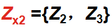
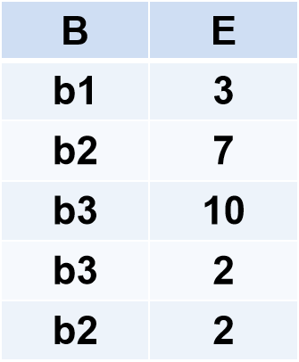

# 2 关系数据库

### 2.1  关系数据结构及形式化定义

##### 2.1.1 关系

现实世界的实体以及实体间的各种联系均用关系来表示，从用户角度，关系模型中数据的**逻辑结构**是一张二维表。关系建立在集合代数的基础上 。

1. 域

​	域是一组具有**相同数据类型**的值的集合。

​	例:整数，实数，介于某个取值范围的整数，指定长度的字符串集	合，{‘男’，‘女’}……

2. 笛卡尔积

   给定一组域D1，D2，…，Dn，允许其中某些域是相同的。
   D1，D2，…，Dn的笛卡尔积为：
   D1×D2×…×Dn =｛（d1，d2，…，dn）｜di∈Di，i＝1，2，…，	n｝
   是**所有域**的**所有取值**的一个组合，不能重复。

   例：给出三个域，D1=导师集合SUPERVISOR=｛张清玫，刘逸｝
   	D2=专业集合SPECIALITY=｛计算机专业，信息专业｝
   	D3=研究生集合POSTGRADUATE=｛李勇，刘晨，王敏｝。基	数为	2×2×3＝12。

   元组（Tuple）：
   笛卡尔积中每一个元素（d1，d2，…，dn）叫作一个n元组（n-tuple）或简称元组。(张清玫，计算机专业，李勇)、 (张清玫，计算机专业，刘晨)  等 都是元组 。   
   分量（Component）：
   笛卡尔积元素（d1，d2，…，dn）中的每一个值di 叫作一个分量
   张清玫、计算机专业、李勇、刘晨等都是分量 。
   笛卡尔积的表示方法：
   笛卡尔积可表示为一张二维表。表中的每**行**对应一个**元组**，表中的每**列**对应一个**域**。

3. 关系
   	D1×D2×…×Dn的**子集**叫作在域D1，D2，…，Dn上的**关系**，表示为	R（D1，D2，…，Dn），R：关系名，n：（域的个数）关系的目或度（Degree）。

   元组：
   关系中的每个元素（d1，d2，…，dn）是关系中的一个n元组，通常用t表示。

   属性：

   关系中不同列可以对应相同的域，为了加以区分，必须对每列起一个名字，称为属性（Attribute）。n目关系必有n个属性。

   码：

   候选码（Candidate key）：若关系中的某一属性组的值能唯一地标识一个元组，则称该属性组为候选码。简单的情况：候选码只包含一个属性。
   全码（All-key）：最极端的情况：关系模式的**所有属性**组是这个关系模式的候选码，称为全码（All-key）。

   主码：若一个关系有多个候选码，则选定其中一个为主码（Primary key）。
   主属性：候选码的属性称为主属性（Prime attribute），不包含在任何侯选码中的属性称为非主属性（Non-Prime attribute）或非码属性（Non-key attribute） 。

   基本的**关系性质**：

   列是同质的（Homogeneous）。
   不同的列可出自同一个域。
   其中的每一列称为一个属性，不同的属性要给予不同的属性名。
   列的顺序无所谓，列的次序可以任意交换。

   行的顺序无所谓，行的次序可以任意交换

   任意两个元组的**候选码**不能相同。 

   分量必须取原子值，这是规范条件中最基本的一条，即不能有小表。

D1，D2，…，Dn的笛卡尔积的**某个子集**才有实际含义。
例：表2.1 的笛卡尔积没有实际意义，下面是有实际意义的子集。      

| **SUPERVISOR** | **SPECIALITY** | **POSTGRADUATE** |
| -------------- | -------------- | ---------------- |
| **张清玫**     | **计算机专业** | **李勇**         |
| **张清玫**     | **计算机专业** | **刘晨**         |
| **刘逸**       | **信息专业**   | **王敏**         |

主码为**POSTGRADUATE**，因为研究生与导师是1：n的关系。

##### 2.1.2 关系模式

从型和值的角度来看，**关系模式是型，关系是值**。

关系模式是对关系的描述。

关系模式可以形式化地表示为：
    	R（U，D，DOM，F）
		R：关系名
		U：组成该关系的属性名集合
		D：U中属性所来自的域
		DOM：属性向域的映象集合
		F：属性间数据的依赖关系的集合

**域名**及**属性向域的映象**常常直接说明为属性的类型、长度。

关系模式通常可以简记为：R (U) 或R (A1，A2，…，An)
R: 关系名，A1，A2，…，An  : 属性名，

关系模式与关系的区别：
关系模式是对关系的描述，是**静态的、稳定的**。
关系是关系模式在**某一时刻的状态或内容**，是动态的、随时间不断变化的。
关系模式和关系往往笼统称为关系，通过上下文加以区别。

##### 2.1.3 关系数据库

关系数据库：
在一个给定的应用领域中，所有关系的集合构成一个关系数据库。
关系数据库的型与值：
关系数据库的型: 关系数据库**模式**，是对关系数据库的描述。
关系数据库的值: 关系模式在某一时刻对应的关系的集合，通常称为**关系数据库**。

##### 2.1.4 关系模型的存储结构

关系数据库的物理组织：
有的关系数据库管理系统中**一个表对应一个操作系统文件**，将物理数据组织交给**操作系统**完成。
有的关系数据库管理系统从操作系统那里申请若干个大的文件，自己划分文件空间，组织表、索引等存储结构，并进行存储管理。

### 2.2 关系操作

常用的关系操作：
查询操作：选择、投影、连接、除、并、差、交、笛卡尔积，选择、投影、并、差、笛卡尔基是5种基本操作。
数据更新：插入、删除、修改。
关系操作的特点：
操作的**对象和结果都是集合**，一次一集合的方式。

### 2.3 关系的完整性

1. 实体完整性

   **主码唯一且非空**。

   若属性A是基本关系R的主属性，则属性A**不能取空值**。
   空值就是“不知道”或“不存在”或“无意义”的值。

2. 参照完整性

   外码要么为**空**，要么对应另⼀表的**主码**。

   在关系模型中实体及实体间的联系都是用关系来描述的，自然存在着关系与关系间的引用。

   例：学生实体、专业实体
   学生（<u>学号</u>，姓名，性别，**专业号**，年龄）
   专业（<u>专业号</u>，专业名）

   学生关系引用了专业关系的主码“专业号”，学生关系中的“专业号”值必须是确实存在的专业的专业号。

   设F是基本关系R的一个或一组属性，但**不是关系R的码**。如果F与基本关系**S的主码Ks**相对应，则称F是R的外码。基本关系R称为参照关系（Referencing  Relation），基本关系S称为被参照关系（Referenced Relation）或目标关系（Target Relation）。

3. 用户定义完整性

   应用领域需要遵循的约束条件，体现了**具体**领域中的**语义约束**。 

   例：课程（<u>课程号</u>，课程名，学分）
   “课程号”属性必须取唯一值，非主属性“课程名”也不能取空值，“学分”属性只能取值{1，2，3，4}。

### 2.4 关系代数

关系代数是一种抽象的查询语言，它用对关系的运算来表达查询。
关系代数中运算对象是关系，运算结果亦为关系。
关系代数的运算符有两类：**集合运算符**和专门的**关系运算符**。
传统的**集合运算**是从关系的“水平”方向即**行的角度**进行，专门的**关系运算**不仅涉及**行而且涉及列**。

表2.4 关系代数运算符

1. 集合运算符

   R
   
    

​		S

​		

​		并：R∪S

​		

​		差：R-S

​		

​		交：R∩S

​		

​		笛卡尔积：RXS

​		R: n目关系，k1个元组.
​		S: m目关系，k2个元组.
​		R×S 
​		列：（n+m）列元组的集合，元组的前n列是关系R的一个元组，后m列是关系S的一个元组。
​		行：k1×k2个元组，

​        

2. 专门的关系运算符

   先引入几个记号 ：

   R，t∈R，t[Ai]。
   设关系模式为R(A1，A2，…，An)，它的一个关系设为R。

   t∈R表示t是R的一个元组，t[Ai]则表示元组t中相应于属性Ai的一个分量 。

   。

   若A={Ai1，Ai2，…，Aik}，其中Ai1，Ai2，…，Aik是A1，A2，…，An中的一部分，则A称为属性列或属性组。
   t[A]=(t[Ai1]，t[Ai2]，…，t[Aik])表示元组t在属性列A上诸分量的集合。
   则表示{A1，A2，…，An}中去掉{Ai1，Ai2，…，Aik}后剩余的属性组。   

   象集：

   给定一个关系R（X，Z），X和Z为属性组。
   当t[X]=x时，x在R中的象集（Images Set）为：
   
   
   
   例：
   
    
   
   x1在R中的象集，，x2在R中的象集，x3在R中的象集，。
   
   选择σ：
   
   在关系R中选择满足给定条件的诸元组F：选择条件，是一个逻辑表达式，取值为“真”或“假”。
   
   选择运算是从关系R中选取使逻辑表达式F为真的元组，是从**行**的角度进行的运算。
   
   投影π：
   
   从R中选择出若干属性列组成新的关系，πA(R) = { t[A] | t ∈R }，A：R中的属性列 。
   
   投影操作**主要是从列**的角度进行运算，投影之后不仅取消了原关系中的某些列，而且还**可能取消某些元组**（避免重复行）。
   
   连接θ：
   
   连接运算的含义从两个关系的笛卡尔积中选取属性间满足一定条件的元组，，A和B：分别为R和S上度数相等且可比的属性组，θ：比较运算符 。
   
   连接运算从R和S的广义笛卡尔积R×S中选取R关系在A属性组上的值与S关系在B属性组上的值满足比较关系θ的元组 。
   
   两类常用连接运算：等值连接（equijoin），自然连接（Natural join）。
   
   等值连接：
   
   θ为“＝”的连接运算称为等值连接，
   
   自然连接：
   
   是一种特殊的等值连接，两个关系中**进行比较的分量必须是相同的属性组**，并且在结果中把**重复的属性列去掉**。，R和S具有相同的属性组B。
   
   自然连接需要取消重复列，所以是**同时从行和列**的角度进行运算。 
   
   例：
   
   R
   
    
   
   S
   
    
   
   一般连接 
   
    
   
   等值连接
   
    
   
   自然连接
   
    
   
   悬浮元组（Dangling tuple）：两个关系R和S在做自然连接时，关系R中某些元组有可能在S中**不存在公共属性上值相等的元组**，从而造成R中这些元组在操作时被舍弃了，这些被舍弃的元组称为悬浮元组。
   
   外连接：
   
   如果把悬浮元组也保存在结果关系中，而在其他属性上填空值(Null)，就叫做外连接。
   
   左外连接(LEFT OUTER JOIN或LEFT JOIN)，只保留左边关系R中的悬浮元组。
   右外连接(RIGHT OUTER JOIN或RIGHT JOIN)，只保留右边关系S中的悬浮元组。
   
   RS的外链接
   
    
   
   RS的左外连接
   
    
   
   RS的右外连接
   
    
   
   除运算：
   
   给定关系R (X，Y) 和S (Y，Z)，其中X，Y，Z为属性组。
   
   R中的Y与S中的Y可以有不同的属性名，但必须出自**相同的域集**。
   R与S的除运算得到一个**新的关系P(X)**，P是R中满足下列条件的元组在 X 属性列上的投影：
   元组在**X**上分量值x的象集，包含S在Y上投影的集合，记作：
   
   
   
   除操作是同时从行和列角度进行运算。
   
   例：R÷S
   
   R
   
    
   
   S
   
    
   
   R和S的共有属性为BC，在R上取A的象集。
   
   关系R中，A可以取四个值{a1，a2，a3，a4}。a1的象集为 {(b1，c2)，(b2，c3)，(b2，c1)}，a2的象集为 {(b3，c7)，(b2，c3)}，a3的象集为 {(b4，c6)}，a4的象集为 {(b6，c6)}。
   
   S在BC上的投影为 {(b1，c2)，(b2，c1)，(b2，c3) }。
   
   只有a1的象集**包含**了S在(B，C)属性组上的投影，所以**R÷S ={a1}** 。
   
   
   
   

