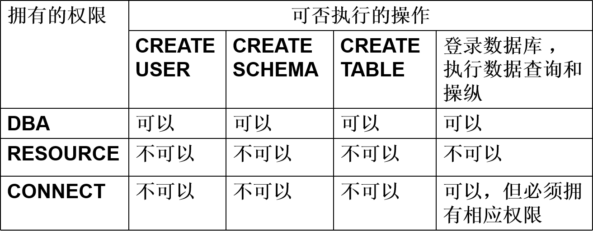

# 4 数据库安全性

数据库的安全性是指保护数据库以防止不合法使用所造成的数据泄露、更改或破坏 。

系统安全保护措施是否有效是数据库系统主要的性能指标之一。

### 4.1 数据库安全性概述

##### 4.1.1 数据库的不安全因素

1. 非授权用户对数据库的恶意存取和破坏。

2. 数据库中重要或敏感的数据被泄露。

3. 安全环境的脆弱性，数据库的安全性与计算机系统的安全性紧密联系，包括计算机硬件、操作系统、网络系统等的安全性。

##### 4.1.2 安全标准简介

TCSEC/TDI安全级别划分

A1安全级别最高，D最低几乎没有保护，C2是安全产品的最低档次，B1级产品是真正意义上的安全产品。

CC评估保证级（EAL）划分 

### 4.2 数据库安全控制

计算机系统中，安全措施是一级一级层层设置，下图为计算机系统的安全模型 ：

每层都有自己的安全措施。

1. 系统根据用户标识鉴定用户身份，合法用户才准许进入计算机系统。
2. **数据库管理系统**还要进行存取控制，只允许用户执行合法操作 
   操作系统有自己的保护措施 。
3. 操作系统有自己的安全措施。
4. 在磁盘上，数据以密码形式存储到数据库中。

数据库安全性控制的常用方法包括：**用户标识和鉴定，存取控制，视图，审计，数据加密。**

数据库管理系统安全性控制模型。

DBMS对提出SQL访问请求的数据库用户进行身份鉴别，防止不可信用户使用系统。

SQL处理层进行自主存储控制和强制存储控制，进一步可以进行推理控制。

可以对用户访问行为和系统关键操作进行**审计**，对异常用户行为进行**简单入侵检测**。

##### 4.2.1 用户身份鉴别

用户身份鉴别（Identification &  Authentication）是系统提供的**最外层**安全保护措施。
用户标识：由**用户名**和**用户标识号**组成（用户标识号在系统整个生命周期内唯一）。

用户身份鉴别的方法：

1. 静态口令鉴别
   静态口令一般由用户自己设定，这些口令是静态不变的。安全性较低。
2. 动态口令鉴别
   口令是动态变化的，每次鉴别时均需使用动态产生的新口令登录数据库管理系统，即采用一次一密的方法。安全性相对高。
3. 智能卡鉴别
   智能卡是一种不可复制的硬件，内置集成电路的芯片，具有硬件加密功能。
4. 生物特征鉴别
   通过生物特征进行认证的技术，生物特征如指纹、虹膜和掌纹等。安全性有质的飞跃。

##### 4.2.2 存取控制

用户是合法用户，但不意味着该用户有权利访问所有的数据。存取控制保证每个用户只能访问权限内的数据。

存取控制机制组成：

1. 定义用户权限，并将用户权限登记到**数据字典**中
   用户对某一数据对象的**操作权力称为权限** 。
   DBMS提供适当的语言来定义用户权限，存放在数据字典中，称做安全规则或授权规则 。

2. 合法权限检查

   用户发出存取数据库操作请求，DBMS查找数据字典，进行合法权限检查。

**用户权限定义和合法权检查机制一起组成了数据库管理系统的存取控制子系统。**

常用存取控制方法包括自主存取控制和强制存取控制。

##### 4.2.3 自主存取控制方法

自主存取控制（Discretionary Access Control ，简称DAC），C2级。
用户对不同的数据对象有不同的存取权限。
不同的用户对同一对象也有不同的权限。
用户还可将其拥有的存取权限转授给其他用户。

通过 SQL 的GRANT 语句和REVOKE 语句实现。
**用户权限由数据对象和操作类型组成。**
定义用户存取权限：定义用户可以在哪些数据库**对象**上进行哪些类型的**操作**。
定义存取权限称为授权 。

##### 4.2.4 授权：授予与回收

用GRANT语句授权。

GRANT语句的一般格式：
       GRANT <权限>[,<权限>]... 
       ON <对象类型> <对象名>[,<对象类型> <对象名>]…
       TO <用户>[,<用户>]...
       [WITH GRANT OPTION];
语义：将对指定操作对象的指定操作权限授予指定的用户 。

WITH GRANT OPTION：表示可以再转授权限，若无该子句则不能传播权限。

不允许**循环授权**，即图中情况：

能发出GRANT的人：数据库管理员，数据库对象创建者（即属主Owner），拥有该权限的用户（且能传播该权限）。

按受权限的用户 ：一个或多个具体用户，PUBLIC（即全体用户）。  

例：把查询Student表权限授给用户U1。
      GRANT   SELECT 
      ON   TABLE   Student 
      TO   U1;

例：把对Student表和Course表的**全部权限**授予用户U2和U3。
      GRANT **ALL PRIVILIGES** 
      ON TABLE Student,Course 
      TO U2,U3;

例：把对表SC的查询权限授予所有用户。
     GRANT SELECT 
     ON TABLE SC 
	  TO **PUBLIC;**

例：把查询Student表和**修改学生学号**的权限授给用户U4。
	  GRANT **UPDATE(Sno)**, SELECT 
		ON TABLE Student 
		TO U4;

**对属性列的授权时必须明确指出相应属性列名 。**

例：把对表SC的INSERT权限授予U5用户，并允许他再将此权限授予其他用户。
    GRANT INSERT 
    ON TABLE SC 
    TO U5
    **WITH GRANT OPTION**;

U5不仅拥有了对表SC的INSERT权限，还可以传播此权限：
			GRANT INSERT 
             ON TABLE SC 
             TO U6
             WITH GRANT OPTION;

U6还可以将此权限授予U7：
 			GRANT INSERT 
	         ON TABLE SC 
             TO U7;
但**U7不能再传播此权限**。

执行了上述语句后学生-课程数据库中的用户权限定义表 如下：

用REVOKE语句回收权限。

REVOKE
授予的权限可以由数据库管理员或其他授权者用REVOKE语句**收回**。
REVOKE语句的一般格式为：
    REVOKE <权限>[,<权限>]... 
    ON <对象类型> <对象名>[,<对象类型><对象名>]…
    FROM <用户>[,<用户>]...[CASCADE | RESTRICT];

CASCADE ：级联回收，回收某个用户的权限时会把由他传播出去的权限也一并回收。

RESTRICT：受限回收，如果该用户已经传播了相应权限，回收会失败，需要先回收被传播的权限。

如果不指定CASCADE 或RESTRICT则使用缺省值，不同DBMS的缺省值不一定相同。

不允许循环授权是因为在CASCADE 会产生死循环，在RESTRICT下找不到回收的起始点。

例：把用户U4修改学生学号的权限收回。
		REVOKE UPDATE(Sno)
		ON TABLE Student 
		FROM U4;

例：收回所有用户对表SC的查询权限。
		REVOKE SELECT 
		ON TABLE SC 
		FROM PUBLIC;

例：把用户U5对SC表的INSERT权限收回。
		REVOKE INSERT 
		ON TABLE SC 
		FROM U5 **CASCADE** ;

将用户U5的INSERT权限收回的时候应该使用CASCADE，否则拒绝执行该语句 。
如果U6或U7还从其他**用户处获**得对SC表的INSERT权限，则他们仍具有此权限，**系统只收回直接或间接从U5处获得的权限** 。

执行上述语句后学生-课程数据库中的用户权限定义表如下：

创建数据库模式的权限 。

数据库管理员在创建用户时实现。
CREATE USER语句格式
              CREATE  USER  <username> 
              [WITH] [DBA|RESOURCE|CONNECT];
注： CREATE USER不是SQL标准，各个系统的实现相差甚远。

CREATE USER语句格式说明：
只有系统的**超级用户**才有权创建一个新的数据库用户。
新创建的数据库用户有三种权限：CONNECT、RESOURCE和DBA。
如没有指定创建的新用户的权限，**默认**该用户拥有**CONNECT**权限。拥有CONNECT权限的用户不能创建新用户，不能创建模式，也不能创建基本表，**只能登录数据库**。

拥有RESOURCE权限的用户能**创建基本表和视图**，成为所创建对象的**属主**。但不能创建模式，不能创建新的用户。

拥有**DBA权限的用户是系统中的超级用户**，可以创建新的用户、创建模式、创建基本表和视图等；DBA拥有对**所有数据库对象**的**存取权限**，还可以把这些权限授予一般用户。

##### 4.2.5 数据库角色

定义：被命名的**一组与数据库操作相关的权限**。

角色是权限的集合 ，可以为一组具有相同权限的用户创建一个角色，**以简化授权**的过程。

通过角色来实现将一组权限授予一个用户。
步骤如下：

1. 首先创建一个角色 

   CREATE  ROLE  <角色名> ;

2. 然后使用GRANT语句

   GRANT  <权限>[,<权限>]… 
   ON <对象类型>对象名  
   TO **<角色>[,<角色>]**…

3. 将一个角色授予其他的角色或用户

   GRANT  <角色1>[,<角色2>]…
   TO  <角色3>[,<用户1>]… 
   [WITH ADMIN OPTION]

   该语句把角色授予某用户，或授予另一个角色。若被授予权限的一个角色，则这个角色的全部权限会再加上其他角色
   授予这个角色的全部权限。

   **授予者**是角色的创建者或拥有在这个角色上的ADMIN OPTION。
   指定了WITH ADMIN OPTION则获得某种权限的角色或用户还可以把这种权限授予其他角色。

4. 角色权限的收回 
   REVOKE <权限>[,<权限>]…
   ON <对象类型> <对象名>
   FROM **<角色>[,<角色>]**…
   用户可以回收角色的部分权限，从而修改角色拥有的权限。
   **REVOKE执行者**是角色的**创建者**或者拥有在这个（些）角色上的**ADMIN OPTION**。

例：通过角色来实现将一组权限授予一个用户。
步骤如下：

1. 首先创建一个角色 R1

   CREATE  ROLE  R1;

2. 然后使用GRANT语句，使角色R1拥有Student表的SELECT、UPDATE、INSERT权限

   GRANT SELECT, UPDATE, INSERT 
   ON TABLE Student 
   TO R1;

3. 将这个角色授予王平，张明，赵玲。使他们具有角色R1所包含的全部权限
   GRANT  R1 
   TO 王平,张明,赵玲;
4. 可以一次性通过R1来回收王平的这3个权限
   REVOKE  R1 FROM 王平;

例：角色的权限修改
        GRANT DELETE 
        ON TABLE Student
        TO R1;

使角色R1在原来的基础上**增加**了Student表的DELETE 权限。

例：减少权限

  	  REVOKE SELECT 
        ON TABLE Student
        FROM  R1；
使R1减少了SELECT权限。

##### 4.2.6 强制存取控制方法

自主存取控制缺点：

可能存在数据的“无意泄露”。存在用户访问了数据并复制数据给没有访问权限的人的可能。
原因：这种机制仅仅通过对数据的存取权限来进行安全控制，而**数据本身并无安全性标记**。
解决：对系统控制下的所有主客体实施**强制存取控制策略**。

强制存取控制（MAC）

保证更高程度的安全性。

用户不能直接感知或进行控制。
适用于对数据有严格而固定密级分类的部门，如军事部门，政府部门。

在强制存取控制中，数据库管理系统所管理的全部实体被分为**主体和客体**两大类。

1. 主体是系统中的活动实体
   如数据库管理系统所管理的实际用户，代表用户的各进程。

2. 客体是系统中的被动实体，受主体操纵
   如文件、基本表、索引、视图。

敏感度标记（Label）
对于主体和客体，DBMS为它们每个实例（值）指派一个敏感度标记（Label）。
敏感度标记分成若干级别
绝密（Top Secret，TS）
机密（Secret，S）
可信（Confidential，C）
公开（Public，P）
TS>=S>=C>=P
主体的敏感度标记称为**许可证级别**（Clearance Level）。
客体的敏感度标记称为**密级**（Classification Level）。

强制存取控制规则：

1. 仅当主体的许可证级别**大于或等于**客体的密级时，该主体才能**读取**相应的客体。

2. 仅当主体的许可证级别小于或等于客体的密级时，该主体才能写相应的客体。

   例如主体的许可级别是机密，**仅**能写机密和**绝密**级别的文件，当写的文件是绝密文件时，仅可写不可读。

   以防止恶意降低文件的密级泄露数据。

强制存取控制（MAC）是对**数据本身进行密级标记，无论数据如何复制，标记与数据是一个不可分的整体**，只有符合密级标记要求的用户才可以操纵数据。
实现强制存取控制时要首先实现自主存取控制。
原因：较高安全性级别提供的安全保护要包含较低级别的所有保护。
**自主存取控制与强制存取控制共同构成**数据库管理系统的安全机制。

DAC + MAC安全检查：

先进行自主存取控制检查，通过自主存取控制检查的数据对象再由系统进行强制存取控制检查，只有通过强制存取控制检查的数据对象方可**存取**。

### 4.3 视图机制

把要保密的数据对无权存取这些数据的用户隐藏起来，对数据提供一定程度的安全保护。 
间接地实现支持存取谓词的用户权限定义，比如授予用户查询某些行的权限。

例：建立计算机系学生的视图，把对该视图的SELECT权限授于王平，把该视图上的所有操作权限授于张明 。
先建立计算机系学生的视图CS_Student。
	CREATE VIEW CS_Student
    AS 
    SELECT  *
    FROM   Student
    WHERE  Sdept='CS';

在视图上进一步定义存取权限：
     GRANT  SELECT
     ON  CS_Student  
     TO 王平;

​     GRANT ALL PRIVILIGES
​     ON  CS_Student  
​     TO  张明; 

### 4.4 审计

用户身份鉴别，自主存取控制，强制存取控制，视图等安全控制措施是预防性措施，只能防患于未然。

审计是一种监控性措施，是对预防性措施的有效补充，互相配合使数据库安全性更有保障。

启用一个专用的审计日志（Audit Log），将用户对数据库的**所有操作**记录在上面。
审计员利用审计日志监控数据库中的各种行为，找出非法存取数据的人、时间和内容。
C2以上安全级别的DBMS必须具有审计功能。

可以被审计的事件：

1. 服务器事件，审计数据库服务器发生的事件。
2. 系统权限，对系统拥有的结构或模式对象进行操作的审计。要求该操作的权限是通过系统权限获得的。
3. 语句事件，对SQL语句，如DDL、DML、DQL及DCL语句的审计。
4. 模式对象事件，对**特定模式对象**上进行的SELECT或DML操作的审计。

用户身份鉴别，自主存取控制，强制存取控制都可以被审计。

审计日志管理：

1. 基本功能：提供多种审计查阅方式。
2. 多套审计规则：一般在初始化时设定。
3. 提供审计分析和报表功能。
4. 审计日志管理功能：
   防止审计员误删审计记录，审计日志必须先转储后删除。
   对转储的审计记录文件提供完整性和保密性保护。
   只允许审计员查阅和转储审计记录，**不允许**任何用户**新增和修改**审计记录等。
   提供查询审计设置及审计记录信息的专门视图。

审计功能的可选性：
审计很费时间和空间。
DBA可以根据应用对安全性的要求，灵活地打开或关闭审计功能。
审计功能主要用于安全性要求较高的部门。

审计功能设置：

AUDIT语句和NOAUDIT语句，AUDIT语句：设置审计功能，NOAUDIT语句：取消审计功能 。

用户级审计：
任何用户可设置的审计，主要是用户针对**自己创建的数据库表和视图**进行审计。

系统级审计：
只能由数据库管理员设置。
监测成功或失败的登录要求、监测授权和收回操作以及其他数据库级权限下的操作。

例：对修改SC表结构或修改SC表数据的操作进行审计
           AUDIT ALTER,UPDATE  
           ON  SC;

例：取消对SC表的一切审计
           NOAUDIT  ALTER,UPDATE  
           ON  SC;

### 4.5  数据加密

数据加密是防止数据库中数据在**存储和传输**中失密的有效手段。
加密的基本思想：
根据一定的算法将原始数据—明文（Plain text）变换为不可直接识别的格式­—**密文**（Cipher text）。

加密方法：存储加密和传输加密。

存储加密：

1. 透明存储加密
   内核级加密保护方式，对用户完全透明（即加密过程对用户不可见）。
   将数据在**写到磁盘时对数据进行加密**，授权用户读取数据时再对其进行解密。
   数据库的应用程序不需要做任何修改，只需在创建表语句中说明需加密的字段即可。
   内核级加密方法: 性能较好，安全完备性较高
2. 非透明存储加密
   通过多个加密函数实现

传输加密：

​	防止数据以明文的方式传输时被截获或者篡改。

1. 链路加密
   传输信息由报头和报文两部分组成。
   报头：路由选择信息；报文：要传送的数据。报文和报头均加密。

2. 端到端加密
   在发送端加密，接收端解密。
   **只加密报文**不加密报头。
   所需密码设备数量相对较少，容易被非法监听者发现并从中获取敏感信息。

### 4.6  其他安全性保护

推理控制：
处理强制存取控制未解决的问题。
避免用户**利用能够访问的数据推知更高密级的数据**。
常用方法：
基于函数依赖的推理控制和基于敏感关联的推理控制。

例：

员工A的权限为公开，仅能看到ID，姓名，职务。但是通过合法的查询请求知道了B和他的职务相同，推理得到了B的工资。

隐蔽通道：

高安全等级用户按照事先约定的方式主动向低安全等级用户传输信息，从而导致高安全等级敏感信息泄露。

### 4.7 小结

实现数据库系统安全性的技术和方法：

1. 用户身份鉴别
2. 存取控制技术：自主存取控制和强制存取控制
3. 视图技术
4. 审计技术
5. 数据加密存储和加密传输

