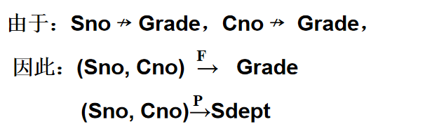
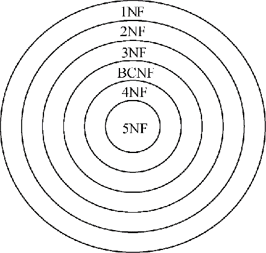

# 6 关系数据理论

##### 6.1.1 问题的提出

关系数据库逻辑设计：
针对一个具体问题，如何构造一个适合于它的数据模式？即应该构造几个关系，每个关系由哪些属性构成等。
问题——**什么是一个好的数据库逻辑设计**？

Student表：

关系模式Student(Sno, Sdept, Mname, Cno, Grade)中存在的问题：

1. 数据**冗余度太大**，浪费存储空间。如：系主任的姓名重复出现，与该系学生的成绩数相同。
2. **更新异常**。数据冗余，更新数据时，维护数据完整性的代价大。如果某系更换系主任，系统必须修改与该系学生有关的每一个元组。
3. **插入异常**，该插入的数据插不进去。如果新成立一个软件工程系，还没有招生，就无法把系以及系主任的信息存入数据库。
4. **删除异常**，不该删除的数据也删除了。如果某个系的学生全部毕业了，我们在删除该系学生信息的同时，把这个系以及系主任的信息也丢失了。

Student不是一个好的关系模式。

一个好的模式不会发生插入异常，删除异常，更新异常，数据冗余应该尽可能少。

问题的原因：由于模式中的某些数据依赖引起的。

解决方法：把这个单一模式分成3个关系模式。

S（Sno, Sdept）, SC(Sno, Cno, Grade), DEPT(Sdept, Mname)，这三个模式不会发生插入异常，删除异常，数据冗余得到控制。

用规范化理论改造关系模式，消除其中不合适的数据依赖。

##### 6.1.2 什么是数据依赖

Student(Sno, Sdept, Mname, Cno, Grade)，该关系模式的属性集合记为U：U={Sno, Sdept, Mname, Cno, Grade}。

数学中的函数y=f(X)，自变量x确定后，相应的函数值y也确定了。

Sdept=f(Sno)，Sno函数确定Sdept，记为Sno→Sdept，Mname=f(Sdept)，Sdept函数确定Mname，记为Sdept→Mname，Grade=f((Sno, Cno))，(Sno, Cno)函数确定Grade，记为（Sno, Cno）→Grade。

属性组U上的函数依赖集合记为F：

F={Sno→Sdept, Sdept→Mname, (Sno, Cno)→Grade}。

数据依赖：

1. 是完整性约束的一种表现形式。限定属性取值范围，定义属性取值间的相互关联，是数据库模式设计的关键。
2. 是通过一个关系中属性间值的相等与否体现出来的数据间的相互关系。是现实世界属性间相互联系的抽象。是数据内在的性质。是语义的体现。

数据依赖的类型包括：**函数依赖**（Functional Dependency, FD），多值依赖（Multivalued Dependency, MVD），连接依赖……

数据依赖对关系模式的影响：

不适合的数据依赖造成插入异常，删除异常，数据冗余。

##### 6.1.3 关系模式的简化表示

关系模式的形式化定义(具体见2.1.2 关系模式)：

R(U, D, DOM, F)。

关系名R是符号化的元组语义，U为一组属性，D为属性组U中的属性所来自的域，DOM为属性到域的映射，F为属性组U上的一组数据依赖。

关系模式的简化表示：

R<U, F>，将关系模式简化为一个三元组，影响数据库模式设计的主要是U和F。当且仅当U上的一个关系r**满足F**时，r成为关系模式R(U, F)的一个关系，即r是R的一个实例。

如何解决Student<U, F>的问题？

用**规范化理论**改造关系模式来消除其中不合适的数据依赖。

### 6.2 规范化

##### 6.2.1 函数依赖

**定义**：设R(U)是一个属性集U上的关系模式，**X和Y是U的子集**。若对于R(U)的任意一个可能的关系r，r 中**不可能**存在两个元组**在X上的属性值相等， 而在Y上的属性值不等**， 则称“**X函数确定Y**”或“**Y函数依赖于X**”，记作**X→Y**。（由X可以唯一确定Y）。

 

例：Student(Sno, Sname, Ssex, Sage, Sdept),         
    假设**不允许重名**，则有:
	Sno → Ssex，      Sno → Sage
	Sno → Sdept，    Sno ←→ Sname
	Sname → Ssex， Sname → Sage
	Sname → Sdept
 

 由Sname→Sno不成立，未给出姓名是唯一的，由一个姓名不能唯一确定一个学号。

函数依赖不是指关系模式R的**某个或某些关系**实例满足的约束条件，而是指R的**所有关系实例**均要满足的约束条件。

**函数依赖是语义范畴的概念，只能根据数据的语义来确定一个函数依赖**（不能由某些实例反推是否存在依赖）。例如“姓名→年龄”这个函数依赖只有在不允许有同名人的条件下成立。数据库的设计者可以对现实世界做强制的规定。例如设计者可以强行规定不允许学生有重名，使得Sname→Sno成立。

函数依赖是关系模式在**任何时刻的关系实例均要满足**的约束条件。

X→Y，但Y⊈X则称X→Y是**非平凡**的函数依赖。
X→Y，但Y⊆X 则称X→Y是**平凡**的函数依赖。

例：在关系SC(Sno, Cno, Grade)中，非平凡函数依赖：（Sno, Cno）→Grade，平凡函数依赖：（Sno, Cno）→Sno, （Sno, Cno）→Cno。

对于任一关系模式，平凡函数依赖都是必然成立的，它不反映新的语义。若不特别声明， 我们**总是讨论非平凡函数依赖**。

**定义**：在R(U)中，如果X→Y，并且对于**X的任何一个真子集X’**, 都有, 则称**Y对X完全函数依赖**，记作。
若X→Y，但Y不完全函数依赖于X，则称Y对X部分函数依赖，记作。

例：在关系SC(Sno, Cno, Grade)中，有：

 

**定义**：在R(U)中，如果X→Y(Y⊈X)，，Y→Z，Z⊈Y, 则称**Z对X传递函数依赖**(transitive functional dependency)。记为：。

例：Student(Sno, Sdept, Mname, Cno, Grade)中，Sno→Sdept, Sdept→Mname，。

##### 6.2.2 码

定义：设K为R<U,F>中的属性或属性组合。若，则K称为R的一个候选码(Candidate Key)。

如果U**部分函数依赖**于K，，即则K称为超码（Surpkey)。**候选码是最小的超码**，即K的任意一个真子集都**不是候选码**。

例：S(Sno, Sdept, Sage)中，Sno→(Sno, Sdept, Sage)，Sno是码， (Sno, Sdept), (Sno, Sage), (Sno, Sdept, Sage)是超码。在SC(Sno, Cno, Grade)中，(Sno, Cno)是码。

若关系模式R有多个候选码，则选定其中的一个做为主码(Primary key)。

主属性与非主属性：
包含在**任何一个候选码**中的属性 ，称为主属性（Prime attribute） 
不包含在任何码中的属性称为非主属性（Nonprime attribute）或非码属性（Non-key attribute）。

例：在SC(Sno, Cno, Grade)中，(Sno, Cno)是码，Sno，Cno是主属性。Grade是非主属性。

全码：**整个属性组是码**，称为全码（All-key）。例R（演奏者，作品，观众），只有码（演奏者，作品，观众）才能确定一个唯一元组。

外码：关系模式 R中属性或属性组X 并非 R的码，但 **X 是另一个关系模式的码**，则称 X 是R 的外部码（Foreign key）也称外码。

[已知函数依赖，如何求候选码](https://blog.csdn.net/MysteriousL/article/details/116022463)：

对于给定的关系R（A1，A2，…An）和函数依赖集F，可将其属性分为4类：

L类：仅出现在函数依赖左部的属性，一定存在于某候选码当中。

R 类：仅出现在函数依赖右部的属性，不属于候选码。

N 类：在函数依赖左右两边均未出现的属性，一定存在于任何候选码当中。

LR类：在函数依赖左右两边均出现的属性，**逐个与L, LR的属性组合**，求属性闭包，若闭包等于U,则为候选码。

定理：对于给定的关系模式R及其函数依赖集F，若X（X∈R）是L类属性，则X必为R的任一**候选码**的成员。
推论：对于给定的关系模式R及其函数依赖集F，若X（X∈R）是L类属性，且X+包含了R的全部属性；则X必为R的唯一候选码。

##### 6.2.3  范式

范式是符合某一种级别的关系模式的集合。
关系数据库中的关系必须满足一定的要求。满足不同程度要求的为不同范式。

范式的种类：

 

各种范式之间存在联系：

 

某一关系模式R为第n范式，可简记为R∈nNF。

 

一个低一级范式的关系模式，通过模式分解（schema decomposition）可以转换为若干个高一级范式的关系模式的集合，这种过程就叫**规范化**（normalization）。

**1NF的定义**：

如果一个关系模式R的所有属性都是**不可分**的基本数据项，则R ∈1NF。

第一范式是对关系模式的**最起码的要求**。不满足第一范式的数据库模式不能称为关系数据模式。

##### 6.2.4  2NF

定义：若关系模式R∈1NF，并且每一个**非主属性**都**完全函数依赖于任何一个候选码**，则R∈2NF。

满足第一范式的关系模式不一定是一个好的关系模式。

例：S-L-C(Sno,Sdept,Sloc,Cno,Grade)， Sloc为学生的住处，并且每个系的学生住在同一个地方。S-L-C的码为(Sno,Cno)。

函数依赖有：

 

主属性：Sno,Cno。

非主属性：Sdept、Sloc并不完全依赖于码。

关系模式S-L-C不属于2NF。

一个关系模式不属于2NF，会产生以下**问题**：

1. 插入异常
   如果插入一个新学生，但该生未选课，即该生无Cno，由于插入元组时，必须给定码值，因此插入失败。
2. 删除异常
   如果S4只选了一门课C3，现在他不再选这门课，则删除C3后，整个元组的其他信息也被删除了。
3. 修改复杂
   如果一个学生选了多门课，则Sdept，Sloc被存储了多次。如果该生转系，则需要修改所有相关的Sdept和Sloc，造成修改的复杂化。数据冗余度高。

出现这种问题的原因是例子中有两类非主属性：

 一类如Grade，它对码完全函数依赖。另一类如Sdept、Sloc，它们对码不是完全函数依赖。
解决方法：
用投影分解把关系模式S-L-C分解成两个关系模式：
SC(Sno,Cno,Grade)，S-L(Sno,Sdept,Sloc)。

SC的码为(Sno,Cno),SL的码为Sno，这样使得**非主属性对码都是完全函数依赖**了。

##### 6.2.5 3NF

定义：设关系模式R<U,F>∈1NF,若R中不存在这样的码X、属性组Y及非主属性Z, 使得X→Y，Y→Z成立，不成立，则称R<U,F> ∈ 3NF。

2NF的问题：

将1NF关系模式通过投影分解法，消除了非主属性对码的部分依赖，分解为多个2NF的关系模式，可以一定程度上减轻原1NF关系模式中的插入异常，删除异常，数据冗余度大的问题，但不能完全消除关系模式中的各种异常和数据冗余。

S-L中的函数依赖：

 

存在非主属性对码的传递函数依赖 。

S-L关系存在的问题：

1. 插入异常

   如果某个系由于某种原因目前没有在校学生，我们就无法把这个系的信息存入数据库。

2. 删除异常

   如果一个系的学生都毕业了，再删除信息的时候把系的居住地信息也删除了。

3. 数据冗余度大

   由于前面的语义知，每个系的学生Sloc相同，Sloc重复出现。

4. 修改复杂

   当学校修改学生住处时，由于每个系的住处信息是重复储存的，修改时必须同时更新该系所有学生的Sloc属性值。

原因：

S-L中存在非主属性**传递函数依赖**码。

解决办法：

解决的办法是将S-L分解成：
S-D(Sno,Sdept)∈ 3NF，D-L(Sdept,Sloc)∈ 3NF。

3NF的一些性质：

如果R∈ 3NF，则R∈ 2NF。

将一个2NF分解为多个3NF的关系后不能完全消除关系模式的各种异常和数据冗余。

##### 6.2.6  BCNF

BCNF（Boyce Codd Normal Form）由Boyce和Codd提出，比3NF更进了一步。通常认为BCNF是修正的第三范式，有时也称为扩充的第三范式。

定义：设关系模式R<U,F>∈1NF，若X →Y且时X必含有码，则R<U,F>∈BCNF。即R<U,F>中如果每一个**决定因素**都包含码，则R<U,F>∈BCNF。

例：关系模式STJ(S,T,J)中，S是学生，T表示教师，J表示课程。

语义：假设每个教师只教一门课。T→J。

每门课由若干老师教，但某一学生选的某门课就确定了一个固定的教师，（S, J）→T。

某个学生选修某个教师的课就确定了所选的课的名称。（S, T）→J。

候选码：(S, T), (S, J)。

S, T, J都是主属性，不存在非主属性对码的部分函数依赖以及传递函数依赖，STJ∈3NF。

STJ关系的问题：

1. 插入异常

   如果某个教师开设了某门课程，但尚未有学生选修，则有关信息无法存入数据库。

2. 删除异常

   如果选修过某门课的学生全部毕业了，在删除这些元组时相应的教师开始该门课的信息也丢失了。

3. 数据冗余度大

   虽然一个教师只教一门课，但是每个选修该教师该门课程的学生元组都要记录这一个信息。

4. 修改复杂

   某个教师开设的某门课程改名后，所有选修了该教师该门课程的学生元组都要修改。

原因：

**主属性**J**部分依赖**码（S, T），因为T→J。

解决办法：

采用投影分解法，将STJ分解为两个关系模式SJ(S, J)，TJ(T, J)。

分解后的关系模式中没有任何属性对码的部分函数依赖和传递函数依赖。

BCNF的性质：

1. 所有非主属性对每一个码都是完全函数依赖。

2. 所有主属性对每一个不包含它的码也是完全函数依赖。

3. 没有任何属性完全函数依赖于非码的任何一组属性。

4. 如果关系模式R∈BCNF，必定有R∈3NF，反之不一定成立。

5. 如果一个关系数据库中的所有关系模式都属于BCNF，那么在**函数依赖**范畴内，以及**实现了模式的彻底分解**，达到了**最高**的规范化程度，**消除了操作异常等诸多问题**。

##### 6.2.7 小结

关系模式规范化的基本步骤：

1NF——（消除非属性对码的部分函数依赖）—>2NF——（消除非主属性对码的传递函数依赖）——>3NF——（消除主属性对码的部分和函数传递依赖）——>BCNF——（消除非平凡且非平凡函数依赖的多值依赖）——>4NF。

规范化的基本思想：
是逐步消除数据依赖中不合适的部分，使模式中的各关系模式达到某种程度的“分离”。
即采用“一事一地”的模式设计原则：
	让一个关系描述一个概念、一个实体或者实体间的一种联系。若多于一个概念就把它“分离”出去。
因此**规范化实质上是概念的单一化**。

不能说规范化程度越高的关系模式就越好。必须对现实世界的实际情况和用户应用需求作进一步分析，确定一个合适的、能够反映现实世界的模式。

### 6.3 数据依赖的公理系统

Armstrong公理系统是一套推理规则，是模式分解算法的理论基础。
用途：求给定关系模式的码，从一组函数依赖求得**蕴涵的函数依赖**。

定义：对于满足一组函数依赖F的关系模式   R <U,F>，其**任何一个关系r**(实例)，若函数依赖X→Y都成立（即r中任意**两元组t、s**，若**t[X]=s[X]**，则 **t[Y]=s[Y]**），则称**F逻辑蕴涵X →Y**。

Armstrong公理系统  

设U为属性集总体，F是U上的一组函数依赖， 于是有关系模式R <U,F >。对R <U,F> 来说有以下的推理规则：

1. A1**自反律**（reflexivity rule）：若Y ⊆X ⊆ U，则X →Y 为F所蕴涵。
2. A2**增广律**（augmentation rule）：若X→Y为F所蕴涵，且Z ⊆U，则XZ→YZ 为F所蕴涵。
3. A3**传递律**（transitivity rule）：若X→Y及Y→Z为F所蕴涵，则X→Z 为F所蕴涵。

根据A1，A2，A3这三条推理规则可以得到下面**三条推理规则**：

1. 合并规则（union rule）

   由X→Y，X→Z，有X→YZ。

2.  伪传递规则（pseudo transitivity rule）

   由X→Y，WY→Z，有XW→Z。

3.  分解规则（decomposition rule）
   由X→Y及Z⊆Y，有X→Z。     

   根据合并规则和分解规则，可得**引理**:
   X→A1 A2…Ak成立的**充分必要条件**是X→Ai成立（i=1，2，…，k）。

函数依赖闭包：

定义：在关系模式R<U,F>中为F所**逻辑蕴涵**的**函数依赖的全体**叫作**F的闭包**，记为**F +**。

定义：设F为属性集U上的一组函数依赖，X⊆U， ={ A|X→A能由F根据Armstrong公理导出}，称为属性集X关于函数依赖集F的闭包。

闭包的引理：设F为属性集U上的一组函数依赖，X、Y ⊆ U，**X→Y**能由F根据Armstrong公理导出的**充分必要条件**是Y ⊆。

该引理的用途：1. 将判定X→Y是否能由F根据Armstrong公理导出的问题转化为求出，判定Y是否为子集的问题。2. 如果=U，X是R<U,F>的候选码。

**求闭包的算法**：

对R<U, F>求属性集X（X ⊆U）关于U上的函数依赖集F的闭包  

输入：X，F
输出： 
步骤：

  

例：已知关系模式R<U, F>，其中U={A, B, C, D, E}；
	F={AB→C, B→D, C→E, EC→B, AC→B}。
	求。

 

AB是一个候选码。

Armstrong公理系统的有效性与完备性的含义：
有效性：由F 出发根据Armstrong公理推导出来的每一个函数依赖一定在F +中。
完备性：F +中的每一个函数依赖，必定可以由F出发根据Armstrong公理推导出来。

**函数依赖集等价**

定义：如果G+=F+（二者的闭包相同），就说函数依赖集F覆盖G（F是G的覆盖，或G是F的覆盖），或F与G等价。

两个函数依赖集等价是指它们的闭包等价。

如果函数依赖集F满足下列条件，则称F为一个极小函数依赖集，亦称为最小依赖集或最小覆盖：

1. F中任一函数依赖的**右部**仅含有一个属性。
2. F中不存在这样的函数依赖X→A， 使得F与F-{X→A}等价。即F中的函数依赖均不能由F中其他函数依赖导出。
3. F中不存在这样的函数依赖X→A， X有**真子集Z**使得F-{X→A}∪{Z→A}与F等价。 F中各函数依赖**左部**均为最小属性集（不存在冗余属性）。

例：R<U, F>, U=ABCD, 函数依赖集F={A→BD, AB→C, C→D}

求F的最小函数依赖集。

解法：

1. 将F中的所有函数依赖的右边化为单一属性。

   F={A→B, A→D, AB→C, C→D}

2. 去掉F中所有函数依赖左边的冗余属性。

   AB→C是否冗余，求A关于F的闭包：。 C在A的闭包中，**B是冗余的**。

   F={A→B, A→D, A→C, C→D}

3. 去掉F中所有冗余的函数依赖。

   A→D，是不死冗余的，F去掉A→D, 求A的闭包，同样得到，A→D冗余，F={A→B, A→C, C→D}。

F的**最小函数依赖集Fm不一定是唯一的**。

6.4 模式的分解

分解具有无损连接性和保持函数依赖性两个标准。
