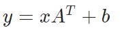

Pytorch

##### 加载数据

```
from torch.utils.data import Dataset, DataLoader
help(Dataset)
```

```
class Dataset(typing.Generic)
 |  Dataset(*args, **kwds)
 |  
 |  An abstract class representing a :class:`Dataset`.
 |  
 |  All datasets that represent a map from keys to data samples should subclass
 |  it. All subclasses should overwrite :meth:`__getitem__`, supporting fetching a
 |  data sample for a given key. Subclasses could also optionally overwrite
 |  :meth:`__len__`, which is expected to return the size of the dataset by many
 |  :class:`~torch.utils.data.Sampler` implementations and the default options
 |  of :class:`~torch.utils.data.DataLoader`.
 |  
 |  .. note::
 |    :class:`~torch.utils.data.DataLoader` by default constructs a index
 |    sampler that yields integral indices.  To make it work with a map-style
 |    dataset with non-integral indices/keys, a custom sampler must be provided.
 |  
 |  Method resolution order:
 |      Dataset
 |      typing.Generic
 |      builtins.object
 |  
 |  Methods defined here:
 |  
 |  __add__(self, other: 'Dataset[T_co]') -> 'ConcatDataset[T_co]'
 |  
 |  __getitem__(self, index) -> +T_co
 |  
 |  ----------------------------------------------------------------------
 |  Data descriptors defined here:
 |  
 |  __dict__
 |      dictionary for instance variables (if defined)
 |  
 |  __weakref__
 |      list of weak references to the object (if defined)
 |  
 |  ----------------------------------------------------------------------
 |  Data and other attributes defined here:
 |  
 |  __orig_bases__ = (typing.Generic[+T_co],)
 |  
 |  __parameters__ = (+T_co,)
 |  
 |  ----------------------------------------------------------------------
 |  Class methods inherited from typing.Generic:
 |  
 |  __class_getitem__(params) from builtins.type
 |  
 |  __init_subclass__(*args, **kwargs) from builtins.type
 |      This method is called when a class is subclassed.
 |      
 |      The default implementation does nothing. It may be
 |      overridden to extend subclasses.
 |  
 |  ----------------------------------------------------------------------
 |  Static methods inherited from typing.Generic:
 |  
 |  __new__(cls, *args, **kwds)
 |      Create and return a new object.  See help(type) for accurate signature.
```

Dataset的作用：1. 提供一种方式获取每个数据以及标签。2. 以及统计总的样本数。

需要重写`__getitem__`和`__len__`方法。

重写后的类实例可以进行**+操作**，**合并为一个数据集**。

##### TensorBoard使用

```
from torch.utils.tensorboard import SummaryWriter
# 输出y=x的坐标
# scalar_value是y轴，global_step是x轴
# 常用于查看训练的loss
writer = SummaryWriter('logs')
for i in range(100):
    writer.add_scalar("y=x", i, i)
writer.close()
```

在终端输入：tensorboard --logdir=logs --port=6007

以指定端口查看输出的logs。如果生成的连接无法打开使用命令：

tensorboard --logdir=logs --host=127.0.0.1

返回http://127.0.0.1:6006/，**不要在终端里退出**tensorboard。

有时候会出现可视化的混乱，比如tag不变，在“y=x"的tag下再加入y=2x的数据，出现：


此时建议清空logs文件，重启tensorboard。或者在进行新的训练时，建立新的输出logs的文件夹。

```
import numpy as np
from PIL import Image
image = Image.open("D:/pytorch/data/hymenoptera_data/train/ants/0013035.jpg")
# image格式不满足add_image的输入要求
# 用opencv读取图片格式是numpy.array
# 用numpy做类型转换
img_arr = np.array(image)
writer = SummaryWriter('logs')
# 输出图像
# 报错格式需要是(3, H, W)，三通道在前，当前格式为(H, W, 3)
# 令dataformats='HWC'
writer.add_image("ant", img_arr, 1, dataformats='HWC')
writer.close()
```

##### transform使用

```
from torchvision import transforms
# 提供图像处理的工具
# ToTensor把PIL个数或者numpy.array转换为Tensor格式
trans_totensor = transforms.ToTensor()
img_tensor = trans_totensor(image)
# Tensor数据类型的优点
# 包装了神经网络需要的属性和方法

# Normalize
# 使用均值和标准差对张量图像进行归一化
# 需要给定均值和标准差
trans_norm = transforms.Normalize([0.5, 0.5, 0.5], [0.5, 0.5, 0.5])
img_norm = trans_norm(img_tensor)
writer = SummaryWriter('logs')
writer.add_image("ant", img_norm, 2)
writer.close()

# Resize
# 将输入图像调整为给定的大小
tran_resize = transforms.Resize((512, 512))
img_resized = tran_resize(img_tensor)
writer = SummaryWriter('logs')
writer.add_image("resizes", img_resized, 3)
writer.close()

# Compose
# 将多个tranform组合在一起
image = Image.open("D:/pytorch/data/hymenoptera_data/train/bees/196658222_3fffd79c67.jpg")
tran_resize_2 = transforms.Resize(512)
tran_compose = transforms.Compose([tran_resize_2, trans_totensor])
img_bee = tran_compose(image)
writer = SummaryWriter('logs')
writer.add_image("bee", img_bee, 1)
writer.close()
```

##### dataset与transform的结合使用

https://pytorch.org/vision/stable/datasets.html#

Pytorch提供一些公共数据集的下载。

```
from torchvision import datasets
train_set = datasets.CIFAR10(root="D:/pytorch/", transform=trans_totensor)
img, label = train_set[0]
print(type(img))
print(train_set.classes[label])
```

##### dataloader使用

```
from torch.utils.data import DataLoader

train_loader = DataLoader(dataset=train_set, batch_size=64, shuffle=True,
                          num_workers=0)
writer = SummaryWriter('dataloader')
for i, data in enumerate(train_loader):
    imgs, labels = data
    print(imgs.shape)
    print(labels)
    writer.add_images("train data", imgs, i)
    if i == 3:
        break
writer.close()
```

##### 神经网络搭建

[TORCH.NN](https://pytorch.org/docs/stable/nn.html)提供神经网络不同layer。

```
import torch.nn as nn
import torch.nn.functional as F
# torch.nn封装了torch.nn.functional
# nn.Module是所有神经网络的基类
# 自定义的模型也应该继承这个类
# Module还可以嵌套


class Model(nn.Module):

    def __init__(self):
        super(Model, self).__init__()
        # 网络结构：
        # 输入->卷积层->卷积层->输出
        self.conv1 = nn.Conv2d(3, 20, 5)
        self.conv2 = nn.Conv2d(20, 20, 5)

    def forward(self, x):
        x = F.relu(self.conv1(x))
        return F.relu(self.conv2(x))
```

##### 卷积函数

```
import torch
import torch.nn.functional as F
data = torch.tensor([[1, 2, 0, 3, 1],
                     [0, 1, 2, 3, 1],
                     [1, 2, 1, 0, 0],
                     [5, 2, 3, 1, 1],
                     [2, 1, 0, 0, 1]])
kernel = torch.tensor([[1, 2, 1],
                       [0, 1, 0],
                       [2, 1, 0]])
# cov2d函数要求的输入格式是4维的(minibatch,in_channels,iH,iW)
# data现在是(5, 5), 需要reshape
input_data = torch.reshape(data, (1, 1, 5, 5))
kernel = torch.reshape(kernel, (1, 1, 3, 3))
# stride：控制卷积核的步长（sH, sW）
output = F.conv2d(input_data, kernel)
print(output)
# padding对输入填充
output2 = F.conv2d(input_data, kernel, padding=1)
print(output2.shape)
```

##### 卷积层

```
from torch import reshape
from torch.utils.data import DataLoader
from torchvision import datasets
import torch.nn as nn
import torch.nn.functional as F
from torchvision import transforms
from torch.utils.tensorboard import SummaryWriter

trans_totensor = transforms.ToTensor()
train_set = datasets.CIFAR10(root="D:/pytorch/", transform=trans_totensor)
train_loader = DataLoader(dataset=train_set, batch_size=64, shuffle=True,
                          num_workers=0)
# Conv2d
# out_channels: 输出的通道数，
# 比如out_channels=1，out_channels=2时
# 有两个卷积核对input做卷积操作，得到两个结果，(1, 2, H, W)


class Demo(nn.Module):

    def __init__(self):
        super(Demo, self).__init__()
        self.conv1 = nn.Conv2d(in_channels=3, out_channels=6, kernel_size=3)

    def forward(self, x):
        x = self.conv1(x)
        return x

demo = Demo()
writer = SummaryWriter('cov2dlogs')
for i, data in enumerate(train_loader):
    imgs, labels = data
    print(imgs.shape)
    output = demo(imgs)
    print(output.shape)
    writer.add_images("inputs", imgs, i)
    # torch.Size([64, 6, 30, 30]) channel超出3无法显示，会报错
    output = reshape(output, (-1, 3, 30, 30))
    writer.add_images("outputs", output, i)
    if i == 2:
        break
writer.close()
```

##### 池化层

```
import torch
from torch import nn
from torch.nn import MaxPool2d
from torchvision import transforms
from torch.utils.tensorboard import SummaryWriter
from torchvision import datasets
from torch.utils.data import DataLoader


class MaxPoolDemo(nn.Module):
    
    def __init__(self):
        super(MaxPoolDemo, self).__init__()
        self.maxpool1 = MaxPool2d(kernel_size=3, ceil_mode=False)

    def forward(self, x):
        output = self.maxpool1(x)
        return output

demo = MaxPoolDemo()

trans_totensor = transforms.ToTensor()
train_set = datasets.CIFAR10(root="D:/pytorch/", transform=trans_totensor)
train_loader = DataLoader(dataset=train_set, batch_size=64, shuffle=True,
                          num_workers=0)

writer = SummaryWriter('maxpoollog')
for i, data in enumerate(train_loader):
    imgs, labels = data
    print(imgs.shape)
    output = demo(imgs)
    print(output.shape)
    writer.add_images("inputs", imgs, i)
    writer.add_images("outputs", output, i)
    if i == 2:
        break
writer.close() 
```

##### 激活层

```
import torch
from torch import nn


input_data = torch.tensor([[1, -0.5],
                           [-1, 3]])
input_data = torch.reshape(input_data, (-1, 1, 2, 2))

class ReLUDemo(nn.Module):
    
    def __init__(self):
        super(ReLUDemo, self).__init__()
        # inplace: 是否替换输入
        self.relu = nn.ReLU()
    
    def forward(self, x):
        return self.relu(x)

demo = ReLUDemo()
output = demo(input_data)
print(output)
```

```
import torch
from torch import nn
from torchvision import transforms
from torch.utils.tensorboard import SummaryWriter
from torchvision import datasets
from torch.utils.data import DataLoader

trans_totensor = transforms.ToTensor()
train_set = datasets.CIFAR10(root="D:/pytorch/", transform=trans_totensor)
train_loader = DataLoader(dataset=train_set, batch_size=64, shuffle=True,
                          num_workers=0)

class SigmoidDemo(nn.Module):
    
    def __init__(self):
        super(SigmoidDemo, self).__init__()
        # inplace: 是否替换输入
        self.sigmoid = nn.Sigmoid()
    
    def forward(self, x):
        return self.sigmoid(x)

demo = SigmoidDemo()
writer = SummaryWriter("./sigmoidlog")
for i, data in enumerate(train_loader):
    imgs, labels = data
    writer.add_images("inputs", imgs, i)
    output = demo(imgs)
    writer.add_images("outputs", output, i)
    if i == 2:
        break
writer.close()
```

##### 线性层（全连接层）

对输入做线性变换，。只做线性变换。

w, b以均匀分布初始化。

##### 模型搭建


以该模型为例。

```
import torch
from torch import nn
from torch.utils.tensorboard import SummaryWriter

class CNN(nn.Module):
    
    def __init__(self):
        # CNN model for CIFAR10
        # input 3,32,32
        super(CNN, self).__init__()
        self.cov1 = nn.Conv2d(3, 32, 5, padding=2, stride=1)
        self.maxpool1 = nn.MaxPool2d(kernel_size=2)
        self.cov2 = nn.Conv2d(32, 32, 5, padding=2, stride=1)
        self.maxpool2 = nn.MaxPool2d(kernel_size=2)
        self.cov3 = nn.Conv2d(32, 64, 5, padding=2, stride=1)
        self.maxpool3 = nn.MaxPool2d(kernel_size=2)
        self.flatten = nn.Flatten()
        # 64*4*4 = 1024
        self.linear1 = nn.Linear(1024, 64)
        self.linear2 = nn.Linear(64, 10)

    def forward(self, x):
        x = self.cov1(x)
        x = self.maxpool1(x)
        x = self.cov2(x)
        x = self.maxpool2(x)
        x = self.cov3(x)
        x = self.maxpool3(x)
        x = self.flatten(x)
        x = self.linear1(x)
        x = self.linear2(x)
        return x
```

使用Sequential:

```
class CNN(nn.Module):
    
    def __init__(self):
        # CNN model for CIFAR10
        # input 3,32,32
        super(CNN, self).__init__()
        self.model = nn.Sequential(
            nn.Conv2d(3, 32, 5, padding=2, stride=1),
            nn.MaxPool2d(kernel_size=2),
            nn.Conv2d(32, 32, 5, padding=2, stride=1),
            nn.MaxPool2d(kernel_size=2),
            nn.Conv2d(32, 64, 5, padding=2, stride=1),
            nn.MaxPool2d(kernel_size=2),
            nn.Flatten(),
            nn.Linear(1024, 64),
            nn.Linear(64, 10)
            )
    def forward(self, x):
        x = self.model(x)
        return x
demo = CNN()
# 使用dummy数据检查网络的正确性
input_data = torch.ones((64, 3, 32, 32))
output = demo(input_data)
print(output.shape)
writer = SummaryWriter("logs_seq")
writer.add_graph(demo, input_data)
writer.close()
```

