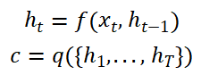

### Encoder-Decoder

从概率的角度来看机器翻译问题，等同于找到一个目标句子**y**，**y**满足在给定的原始语句**x**的条件下具有最大的条件概率，。在机器翻译中，我们拟合参数化模型，学习条件分布，给定一个源句子，就可以通过搜索使条件概率最大化的句子来生成相应的翻译。

这种神经网络通常由两个部分组成，第一个部分**编码**源句子**x**，第二个部分**解码**为目标句子 **y**。

在encoder-decoder框架中，encoder读取输入语句，一个向量序列，并且转化为向量*c*。

其中是t时刻encoder的隐藏层，是1~T的隐藏层生成的向量。***f***和***q***是某些非线性函数。

Decoder通常在给定**上下文向量*c***和所有的之前预测的单词的条件下，用于预测下一个单词。换句话说，解码器通过将联合概率分解为有序条件来定义翻译语**y** 的概率：

其中，对于RNN模型，是输出的概率的函数，是Decoder在t-1时刻的隐藏层。

总结一下，先通过一个Encoder循环神经网络读入所有的待翻译句子中的单词，并生成一个固定长度的向量，输入到Decoder得到翻译的序列。

Encoder-Decoder框架：

### Attention

由于*c*是定长的能存储的信息有限，早期的工作通常采用隐藏层的最后一个状态作为*c*,由于RNN存在长距离依赖，通常会丢失前面的语句信息。一个自然的想法是，对于翻译单词，句子**x**中的单词对它的重要程度不同。那么令*q*为对做加权平均的函数，就可以动态调整*c*包含的单词信息，更多的包含重要单词的信息，即**注意力机制**。

思想：在数学上是一种**加权平均**，通过权重的分配来达到关注重要的信息。

其中是Decoder第i时刻对于Encoder的的权重，为associated energy，有不同的计算方法。

#### 相似度计算方式

[-]: 图片来源2

#### Attention形式

1. Soft/Global attention：采用加权平均，使用**所有**的key(ht)的信息。上述的就是soft attention的计算方式。
2. Hard/Local attention:  使用部分key(ht)的信息，并且对于每个key的信息要么完全采用，要么不采用。
3. Self-Attention: 关联同一输入序列的不同位置。 理论上，self-attention 可以采用上述任意的score函数，只要将目标序列替换为相同的输入序列即可。

##### Soft attention

缺点：当输入很大时计算量大。

##### Hard attention

采取与soft attention相同的的计算方式，区别在于计算*c*的策略。Hard attention对于每个输入的隐藏层，要么全部使用，要么不使用，也就是说权重只能取{0，1}之一。常用的选择使用的隐藏层的方式有：选择最大的隐藏层作为*c*，或者按照的分布进行采样选择一个隐藏层。

其中为指示函数，当条件为真时取1，否则取0。

缺点：由于损失函数与注意力分布之间的函数关系不可导，**无法使用反向传播算法训练**。

##### Self-Attention

是一种将单个序列的不同位置关联起来以计算同一序列的表示的注意力机制。

每个输入单词有3个不同的向量，它们分别是Query向量(Q)，Key向量(K)和Value向量(V)。它们是由**嵌入向量** **X矩阵**乘以三个不同的权值矩阵 得到的，权值矩阵通过训练获得。

[-]: 图片来源5

**K, V, Q的含义**

生活化的例子：

Key: 对应于数据库的关键字，Value: 关键字所关联的实例（视频/商品/文章），Query: 查询的内容。

##### Attention用于不同任务

机器翻译：

query可以定义成Decoder中某一步的隐藏层，key是Encoder中每一步的隐藏层，我们用每一个query对所有key都做一个对齐，Decoder每一步都会得到一个不一样的对齐向量。

文本分类任务：

query可以定义成一个可学的随机变量（参数），key就是输入文本每一步的隐藏层，通过加权求和得到语句向量，再进行分类。

参考：

[1]: https://arxiv.org/abs/1409.0473	"Neural Machine Translation by Jointly Learning to Align and Translate"
[2]: https://zhuanlan.zhihu.com/p/380892265	"小白都能看懂的超详细Attention机制详解"
[3]: https://zhuanlan.zhihu.com/p/35739040	"Attention用于NLP的一些小结"
[4]: https://lilianweng.github.io/lil-log/2018/06/24/attention-attention.html#a-family-of-attention-mechanisms	"Attention? Attention!"
[5]: http://jalammar.github.io/illustrated-transformer/	"The Illustrated Transformer"

