# 决策树算法以及python实现

决策树是一种机器学习方法。

一棵决策树包括一个根节点，若干个内部节点，若干叶子节点。

内部节点： 对应一个属性的划分

叶子节点：对应决策结果

每个节点的样本集合根据属性测试的结果被分到子节点中。

根节点包括全部的样本，从根节点到叶子节点对应判定测试的序列。

 决策树的算法：

```
输入：训练集D，属性集A
函数Treegenerate(D, A)：
    1.生成节点node；
    2.if D中样本全属于一个分类C :
    3.   将node标记为C类叶子节点；
    4.   return
    5.if A == null or (D中样本在A上取值相同):
    6.   将node标记为叶子节点，类别为D中数量最多的类
    7.   return
    8.从A中选择最优划分属性a* 
    9.for  av  in  a*:  # 对a*属性的每一个值av 做循环
    10.   为node生成一个分支，令Dv为D中在a*属性取值为av 的子集
    11.   if Dv == null:#子集为空
    12.      将分支标记为叶节点，类别标记为父节点中类别最多的类 
    13.   else:
    14.      以Treegenerate(Dv, A\{a*})为分支节点  # A去掉a*
    15.输出以node为根节点的树
```

决策树是递归生成的。

三种决策树基于不同的**属性划分方式**：ID3树，C4.5树，CART树。

## ID3树

**信息熵**

信息熵（information entropy）是度量样本集合纯度的一种常用指标。如果样本集合都属于同一类，那么我们就说这个数据集纯度很高。

假如样本集合D中第k类样本所占比例为 Pk（k=1,2,...,|y|），则数据集合D的信息熵为：

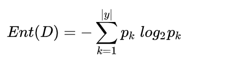

信息熵越小，代表D的纯度越高。

ID3树基于**信息增益**做属性划分。以信息增益来做特征选择，选择信息增益最大的特征进行分裂。算法采用自顶向下的贪婪搜索遍历可能的决策树空间。 

信息增益：

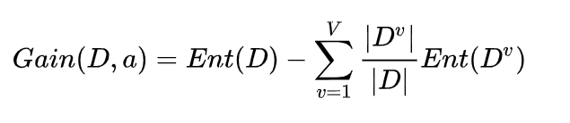

这里a表示某个属性，Gain(D,a)就是**对属性a划分**的信息增益，|D|表示数据集合样本的总体数量，v={1,2,...,V},表示属性a的一系列， 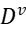表示属性a取值为v时的样本集合的子集；一般而言，信息增益越大，那么意味着使用属性a来划分所获得的“纯度提升”越大。因此，遍历所有属性分别计算信息增益，信息增益最大的那个属性将作为划分属性。

缺点：

1. ID3 没有剪枝策略，容易过拟合。

2. 根据信息增益的公式可以看出，当v的取值越多时，也就是当a的取值越多，那么信息增益Gain(D,a)的取值将会越大，也就是说使用信息增益来选择划分属性时，ID3树**偏向于选择那些取值多**的属性进行划分，显然这样的划分不具有良好的泛化能力。取一个极端的例子，如果把ID作为特征，ID3树把每个样本都划为一个子集，显然划分后的增益最大。

3. 只能用于处理离散分布的特征。

4. 没有考虑缺失值。

## C4.5树

为了克服ID3树对取值多的特征的偏重，c4.5树采用**信息增益率**划分。

信息增益率：

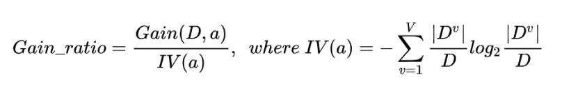

IV（a）称为属性a的“固有值”，属性a 的取值数目越多，则其越大，这样就平衡了信息增益对取值较多的属性的偏好；然而增益率又会对取值数目较少的属性有偏好，因此C4.5树不直接采用信息增益率最大的候选划分属性，又有一个**“启发式”**的规则：

先从候选划分属性中找出信息增益高于平均水平的属性，再从中选择**增益率**最高的。

预剪枝：

在树的生成过程中，根据条件提前停止划分，比如限制树的最大深度，最大叶子节点的数目等条件。预剪枝使决策树的很多分支没有展开，不仅降低了过拟合的风险，还显著减少了训练的开销。但另一方面，有些分支的当前划分不能提升性能，但是后续的划分却有可能使性能显著提高。

后剪枝：

自底而上对非叶子节点检查。

检查将当前节点替换为叶子节点后的验证集准确率，如果准确率提高就把当前节点替换为叶子节点（不再对该节点的属性进行划分，直接按该节点对应的子集的类别最多的类划分为一个叶子节点）。继续向上搜索非叶子节点进行检查。后剪枝可以有效避免过拟合，提高泛化能力，但是计算开支大。

连续型变量处理：

二分离散化。假设 n 个样本的连续特征 A 有 m 个取值，C4.5 将其排序并取相邻两样本值的平均数，共 m-1 个划分点，分别计算以该划分点作为二元分类点时的信息增益，并选择信息增益最大的值作为该连续特征的划分值。

缺失值处理：

用没有缺失的子集所占比重折算。

无缺失样本的信息增益乘以(D’/D)， D’为无缺失的样本子集数。对于特征值缺失的样本，将样本同时划分到所有子节点，不过要调整样本的权重值，其实也就是以不同概率划分到不同节点中。权重：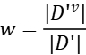，即子节点的无缺失值的样本数量/父节点的无缺失值的样本数量。

优点：

1. 纠正了ID3树对有更多取值的特征的偏好。
2. 能处理连续型变量和有缺失值的样本。

2. 采用后剪枝（悲观错误率剪枝），提高了泛化能力。

缺点：

1. 剪枝策略可以再优化。

2. C4.5 用的是多叉树，用二叉树效率更高。

3. C4.5 只能用于分类。

4. C4.5 使用的熵模型拥有大量耗时的对数运算，连续值还有排序运算。
5. C4.5 在构造树的过程中，对数值属性值需要按照其大小进行排序，从中选择一个分割点，所以只适合于能够驻留于内存的数据集，当训练集大得无法在内存容纳时，程序无法运行。

## CART树

ID3 和 C4.5 虽然在对训练样本集的学习中可以尽可能多地挖掘信息，但是其生成的**决策树分支、规模都比较大**，CART 算法的**二分法**可以简化决策树的规模，提高生成决策树的效率。

CART使用**基尼指数**（gini index）作为属性**划分指标**。

样本集合数据集的纯度除了可以用熵来衡量外，也可以用基尼值来度量：

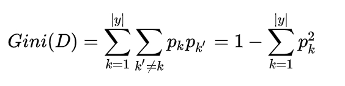 

基尼值反映了从数据集中随机抽取两个样本，其类别标记不一致的概率，因此基尼值越小，则数据集纯度越高。

对属性a进行划分，则属性a的基尼指数定义为：

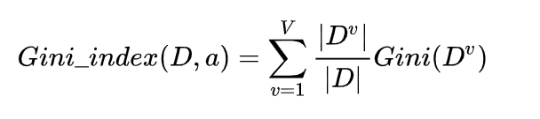

离散变量，对属性a的每个值做是否等于vi的判断划分为两个子集D1，D2。对于连续值的处理，与前面C4.5树的处理方式相同，都是先排序再做二分划分。

因此，在选择划分属性时，应该选择那个使得划分之后基尼指数最小的属性作为划分属性。选择使基尼指数最小的划分点为该属性的划分点。

CART 包含的基本过程有分裂，剪枝和树选择。

1. 分裂：分裂过程是一个二叉递归划分过程，其输入和预测特征既可以是连续型的也可以是离散型的，CART 没有停止准则，会一直生长下去；

2. 剪枝：采用代价复杂度剪枝，从最大树开始，每次选择训练数据熵对整体性能贡献最小的那个分裂节点作为下一个剪枝对象，直到只剩下根节点。CART 会产生一系列嵌套的剪枝树，需要从中选出一颗最优的决策树；

3. 树选择：用单独的测试集评估每棵剪枝树的预测性能（也可以用交叉验证）。

代价复杂度剪枝：

树越复杂训练准确率越高，但泛化的性能不一定高，希望通过控制树的复杂度使泛化性能提高。需要一个单独的验证集评估泛化性能。

定义一个目标函数：

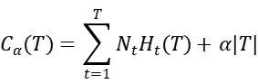

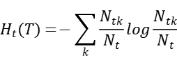

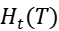是叶子节点t的熵，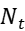是叶子节点的样本量，k样本的类别。

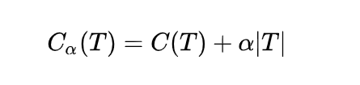

T为任意子树，C(T)误差，|T|为子树的叶子节点个数， α是参数。C(T)衡量训练数据的拟合程度，α|T|衡量树的复杂度，目标函数权衡拟合程度与树的复杂度。

设T0为原始的树，T1是对T0减去一个非叶子节点的树……Ti+1是对Ti减去一个非叶子的节点的树。最后到Tn只有一个根节点。{T0，……，Tn}是一棵决策树剪枝的集合，从中选出一棵**泛化性能最优的树**。

从目标函数可以看出α的取值对函数的值影响很大，若α=0，则损失只与误差有关，此时的令函数值最小的树是T0。若α取正无穷，只与树的复杂度有关，此时令函数值最小的树是只有一个根节点的树。

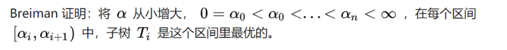

[sklearn的代价复杂度剪枝](https://scikit-learn.org/stable/modules/tree.html#minimal-cost-complexity-pruning)：

1. 计算现在树的每个内部节点替换为叶子节点的时的α。取最小的α对应的内部节点变更为叶子节点。
2. 直到最小的α大于设定的阈值ccp_alpha时停止。

缺失值处理：

与C4.5树相似，采用未缺失的子集折算基尼指数。

对于缺失值的样本划分，采用代理分裂器（替代有缺失值的特征作为划分特征，并且待选为代理的特征分值要超过默认阈值，才能作为代理特征）划分样本。当CART树遇到缺失值，使用排名最高的代理决定将样本划分到左边还是右边。如果样本在代理分裂器中的划分特征值仍然是缺失，那么选择排名第二的代理分裂器，以此类推。如果所有的代理分裂器特征值都是缺失的就默认划分到样本个数更多的节点。这种处理方式在数据量很大的情况下开销太大，而带来的性能提升确有限。

## CART回归树

回归类任务中，使用MSE(Mean Square Error, 平均方差)替代gini index。期望划分得到最小的MSE。


N为父节点的样本数，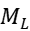为左子节点的样本数。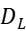为被分到左子节点的样本，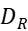为被分到右子节点的样本。

对生成的CART回归树做预测时，用**叶子节点样本集合的均值**（叶子节点y的均值）来作为预测的输出结果。

优点：

1. CART 为二叉树，便于实现，计算开销较小。

2. CART 既可以分类也可以回归。

3. CART 使用 Gini 指数作为集合的度量指标，减少了大量的对数运算。
4. CART 采用“基于代价复杂度剪枝”方法进行剪枝。

## Python实现

参考了sklearn的决策树参数，以及部分值的计算方法，实现了分类与回归树。

```python
from collections import Counter
from _criterion import Gini, Entropy, MSE
from collections import defaultdict
import numpy as np
import copy


class Node():
    """
    决策树的节点。
    """
    def __init__(
                 self,
                 split_val=None,
                 feature=None,
                 samples=[],
                 left=None,
                 right=None,
                 val=None,
                 imputy=None
                 ):
        """
        Parameters
        ----------
        split_val : float, optional
            非叶子节点的最佳划分值. The default is None.
        feature : int, optional
            非叶子节点的划分特征索引. The default is None.
        samples : list/numpy array, optional
            X被划入该节点的样本索引数组. The default is [].
        left : Node, optional
            左叶子节点. The default is None.
        right : Node, optional
            右叶子节点. The default is None.
        val : float, optional
            节点的值，分类树取样本中最多的类，回归树取样本标签均值. The default is None.
        imputy : 纯度, optional
            节点样本的纯度. The default is None.

        Returns
        -------
        None.

        """
        self.split_val = split_val
        self.feature = feature
        self.samples = samples
        self.left = left
        self.right = right
        self.val = val
        self.leaf = None
        self.imputy = imputy

    def __str__(self):
        return "split feature:{0} split value:{1} node value:{2:.3f}".format(self.feature, self.split_val, self.val)


class DecisionTree():
 
    def __init__(self,
                 max_depth,
                 min_samples_split=1,
                 min_samples_leaf=1,
                 min_impurity_split=0,
                 max_leaf_nodes=None,
                 ccp_alpha=0.0,
                 criterion='gini',
                 objective='classifier'
                 ):
        """

        Parameters
        ----------
        max_depth : int
            决策树最大深度.
        min_samples_split : int, optional
            内部节点分裂所需的最少样本数. The default is 1.
        min_samples_leaf : int, optional
            分裂为叶子节点所需最小样本数. The default is 1.
        min_impurity_split : int, optional
            停止分裂的阈值，分裂的增益大于该值才分裂. The default is 0.
        max_leaf_nodes : int, optional
            叶子节点的最大数. The default is None.
        ccp_alpha : float, optional
            执行代价复杂度剪枝的阈值，min_alpha大于该值停止剪枝. The default is 0.0.
        criterion : str, optional
            样本纯度的计算方法，{'gini', 'entropy', 'mse'}. The default is 'gini'.
        objective : str, optional
            {'classifier', 'regressor'}
            决策树的类型. The default is 'classifier'.

        Returns
        -------
        None.

        """
        self.max_depth = max_depth
        self.min_samples_split = min_samples_split
        self.min_samples_leaf = min_samples_leaf
        self.min_impurity_split = min_impurity_split
        self.max_leaf_nodes = max_leaf_nodes if max_leaf_nodes else 2**max_depth
        self.ccp_alpha = ccp_alpha
        self.criterion = self.__criterion(criterion)  # 计算纯度的类
        self.objective = objective
        self.depth = 0
        self.leaf_num = 0
        self.root = None
        self.X = None
        self.Y = None

    def __criterion(self, criterion):
        """
        返回相应纯度计算标准的类。
        """
        if criterion == 'gini':
            return Gini()
        elif criterion == 'entropy':
            return Entropy()
        elif criterion == 'mse':
            return MSE()
        else:
            raise ValueError("Wrong criterion.")

    def __get_val(self, y):
        """
        返回节点的值。
        """
        if self.objective == 'classifier':
            counts = Counter(y).most_common(1)
            return counts[0][0]
        else:
            return y.mean()

    def __get_subsets(self, x, sample_indexs):
        """
        返回字典，key:xi，value:取xi的样本索引列表。

        """
        out_sets = defaultdict(list)
        for x_val, y in zip(x, sample_indexs):
            out_sets[x_val].append(y)
        return out_sets

    def __split(self, node, depth):
        """
        递归建立决策树，划分当前的node。

        Parameters
        ----------
        node : Node
            当前要划分的节点.
        depth : int
            当前节点的深度.

        Returns
        -------
        None.

        """
        imputy = self.criterion.imputy(self.Y, node.samples)
        node.imputy = imputy  # 存储该节点的imputy
        node.val = self.__get_val(self.Y[node.samples])  # 储存节点的值
        if depth < self.max_depth and self.leaf_num <= self.max_leaf_nodes-2:
            if len(node.samples) < self.min_samples_split or\
                    len(set(self.Y[node.samples])) == 1:
                # 节点的样本量是否高于最低划分量
                # 或者当前节点的样本已经是同一类了
                self.leaf_num += 1
                node.leaf = True
                return
            max_improve = 0
            max_imputy_ind = None
            split_val = 0
            best_left = []
            best_right = []
            N = len(node.samples)
            for i in range(self.X.shape[1]):
                # 遍历features寻找最优划分feature以及特征值
                values = list(set(self.X[node.samples, i]))
                if len(values) <= 1:
                    continue
                values.sort()  # 对feature的取值排序
                # 得到每个取值的索引列表
                subsets = self.__get_subsets(self.X[node.samples, i], node.samples)
                left_inds = []
                right_inds = []
                for j in range(len(values)):
                    right_inds += subsets[values[j]]
                for j in range(0, len(values)-1):
                    # 每次将一个更大值的样本集合并入左子节点，并从右子节点取出
                    left_inds += subsets[values[j]]
                    right_inds = right_inds[len(subsets[values[j]]):]
                    if len(left_inds) < self.min_samples_leaf or \
                            len(right_inds) < self.min_samples_leaf:
                            continue
                    left_imputy = self.criterion.children_impurity(self.Y, left_inds, N)
                    right_imputy = self.criterion.children_impurity(self.Y, right_inds, N)
                    # 计算不纯度的增益
                    imputy_improve = imputy - left_imputy - right_imputy
                    if imputy_improve > max_improve:
                        max_improve = imputy_improve
                        max_imputy_ind = i
                        best_left = left_inds.copy()
                        best_right = right_inds.copy()
                        split_val = (values[j]+values[j+1])/2
            if max_improve >= self.min_impurity_split and max_improve != 0:
                node.left = Node(samples=sorted(best_left))
                node.right = Node(samples=sorted(best_right))
                node.feature = max_imputy_ind
                node.split_val = split_val
                # 继续分裂
                self.__split(node.left, depth+1)
                self.__split(node.right, depth+1)
            else:
                # 停止分裂，该节点记为叶子节点
                self.leaf_num += 1
                node.leaf = True
        else:
            # 记为叶子节点
            self.leaf_num += 1
            node.leaf = True

    def fit(self, X, Y, eval_set=None):
        """
        根据数据X, Y 训练决策树。

        Parameters
        ----------
        X : numpy array
            特征矩阵.
        Y : numpy array
            标签数组.
        eval_set : list, optional
            [eval_X, eval_Y]
            当ccp_alpha>0，需要额外的验证集来剪枝. The default is None.
        Returns
        -------
        None.

        """
        self.X = X
        self.Y = Y
        self.root = Node(samples=list(range(len(X))))
        cur_node = self.root
        self.__split(cur_node, 1)
        if self.ccp_alpha > 0:
            if eval_set is None:
                raise ValueError("Missing eval set")
            # 执行代价复杂剪枝
            self.__pruning(eval_set)
        self.X = None
        self.Y = None
        return

    def predict(self, X):
        """
        返回X的预测。

        """
        if self.root is None:
            raise ValueError("Fit model before using predict")
        # 层级遍历
        queue = [self.root]
        # 初始化根节点样本集
        self.root.samples = np.array(list(range(len(X))))
        out_labels = np.zeros((X.shape[0], 1))
        while queue:
            cur_node = queue.pop(0)
            if cur_node.leaf is None:  # 非叶子节点
                feature = cur_node.feature
                split_val = cur_node.split_val
                # samples内小于划分值的索引
                left_tmp = np.where(X[cur_node.samples, feature] <= split_val)[0]
                # 在Y中的索引
                left_inds = cur_node.samples[left_tmp]
                right_tmp = np.where(X[cur_node.samples, feature] > split_val)[0]
                right_inds = cur_node.samples[right_tmp]
                if len(left_inds) == 0 or len(right_inds) == 0:
                    # X不能再划分时，直接分配为多数的类
                    out_labels[cur_node.samples] = cur_node.val
                    continue
                cur_node.left.samples = left_inds
                cur_node.right.samples = right_inds
                queue.append(cur_node.left)
                queue.append(cur_node.right)
            else:
                # 当前节点为叶子节点，到达该节点的样本记为相应的类型
                out_labels[cur_node.samples] = cur_node.val
        return out_labels

    def __count_RT(self, node):
        """
        计算非叶子节点node的叶子节点的ΣR(T)。
        """
        T = 0
        queue = [node]
        RT = 0
        while queue:
            cur_node = queue.pop(0)
            if cur_node.leaf is True:
                # 记录叶子节点imputy
                T += 1
                RT += cur_node.imputy
            else:
                queue.append(cur_node.left)
                queue.append(cur_node.right)
        return RT, T

    def __pruning(self, eval_set):
        """
        采用代价复杂度剪枝，需要给出验证集或者以cv的方式选择最优子树。
        当树对应的最小a值大于ccp_a时停止剪枝。
        sklearn以叶子节点总imputy替代误分类率，计算R(T)。
        a = R(t)-R(T)/(T-1)
        """
        y_p = self.predict(eval_set[0])
        y_t = eval_set[1]
        if y_p.shape != y_t.shape:
            y_t = y_t.reshape(y_p.shape)
        N = len(y_t)
        num_leaf = self.leaf_num
        if self.objective == 'classifier':
            best_score = 0
        else:
            best_score = -(sum((y_p-y_t)**2)/N)[0]
        best_tree = copy.deepcopy(self.root)  # 深拷贝
        min_alpha = 0
        while self.leaf_num > 1:
            # 当决策树只剩一个树桩停止剪枝
            # 层级遍历现在的树，算出每个非叶子节点的alpha值
            queue = [self.root]
            alphas = []
            nodes = []
            while queue:
                cur_node = queue.pop(0)
                if cur_node.leaf is None:
                    # 非叶子节点
                    Rt = cur_node.imputy
                    RT, T = self.__count_RT(cur_node)
                    alpha = (Rt-RT)/(T-1)
                    alphas.append(alpha)
                    nodes.append((cur_node, T))
                    queue.append(cur_node.left)
                    queue.append(cur_node.right)
            min_alpha = min(alphas)
            if min_alpha > self.ccp_alpha:
                # 或者min_alpha>ccp_alpha停止
                break
            node, T = nodes[alphas.index(min_alpha)]  # 本轮min_alpha对应的节点
            node.left = None
            node.right = None
            node.leaf = True
            node.split_val = None
            node.feature = None
            self.leaf_num -= (T-1)  # 更新叶子节点数
            y_p = self.predict(eval_set[0])  # 更新预测
            # 这里用了acc和mse，其他metric可以用sklearn计算
            if self.objective == 'classifier':
                score = sum([1 for yp, yt in zip(y_p, y_t) if yp == yt])/N
            else:
                score = -(sum((y_p-y_t)**2)/N)[0]
            if score > best_score:
                best_score = score
                best_tree = copy.deepcopy(self.root)
                num_leaf = self.leaf_num
        self.root = best_tree
        self.leaf_num = num_leaf

    def print_tree(self):
        """
        层级遍历打印决策树。

        """
        if self.root:
            queue = [self.root]
            depth = 1
            while queue:
                n = len(queue)
                for i in range(n):
                    cur_node = queue.pop(0)
                    print("depth:", depth, cur_node)
                    if cur_node.leaf is None:
                        queue.append(cur_node.left)
                        queue.append(cur_node.right)
                depth += 1
            self.depth = depth
```


## 参考资料

周志华《机器学习》

[【机器学习】决策树（上）——ID3、C4.5、CART](https://zhuanlan.zhihu.com/p/85731206)

[这可能是你看过的最用心的【决策树算法】介绍文章](https://zhuanlan.zhihu.com/p/32053821)