# 线性回归

### 参考资料

周志华《机器学习》

凸优化|笔记整理（A）——坐标下降法，对偶上升法，再看增强拉格朗日法 - 学弱猹的文章 - 知乎 https://zhuanlan.zhihu.com/p/266625103

LASSO回归求解 - 雨林丶的文章 - 知乎 https://zhuanlan.zhihu.com/p/76055830

##### 多元线性模型：

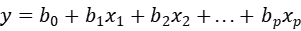

矩阵形式：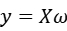

样本矩阵X(nxp)，n为样本数，p为特征数，y(nx1)，(px1)为模型的参数。

线性回归要从X，y中学习，均方误差是回归任务中最常用的性能度量，尝试让均分误差最小化。均方误差的**几何意义**对应了欧几里得距离。基于均分误差最小化来进行模型求解的方法称为最小二乘法。在线性回归中，最下二乘法就是试图找到一条直线，使所有样本点到直线上的欧式距离最小。

损失函数square loss：

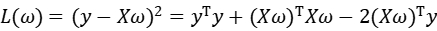

优化目标：

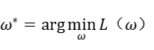

由于该损失函数是一个凸函数，因此导数为0的点就是极值点。

对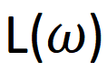求导：


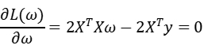

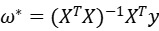

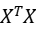不一定可逆。引入正则化，对损失函数加上参数的范数。引入L1范数的线性回归又叫Lasso回归。引入L2范数的线性回归叫岭（Ridge)回归。

##### 岭回归：

损失函数：

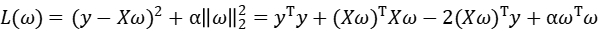

该函数是凸函数，仍然对其求导：

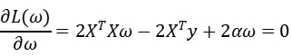


带入X，y计算即可得到参数的估计值。

##### Lasso:

损失函数：

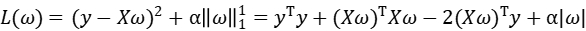

L1范数是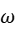的绝对值，不可微，无法直接求解。

[sklearn的Lasso模型采用坐标下降法求解](https://scikit-learn.org/stable/modules/generated/sklearn.linear_model.Lasso.html?highlight=lasso#sklearn.linear_model.Lasso)

坐标下降：

是非梯度优化算法。算法在每次迭代中，在当前点处沿一个坐标方向进行一维搜索以求得一个函数的局部极小值。

问题：

如果函数在**每一个维度上都达到了极小值**，能否保证函数已经找到了极小值点？

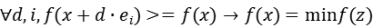

其中e是单位向量。

1. 对于**光滑凸函数**，在每个维度的最小值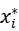, 在该点函数的偏导为0，那么函数在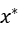处的导数：

   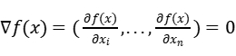 

   该点是最小值点。

2. 对于不光滑的凸函数，该结论不成立。

3. 对于形如 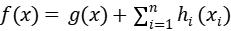的函数，如果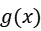是可微的凸函数，并且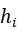都是**凸函数**，那么上述结论成立。

对于Lasso的损失函数显然符合第三种情况，因此可以用坐标下降法。

坐标下降优化步骤：

对每一维坐标求解函数的最小值。

 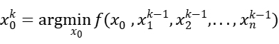

 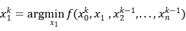

...

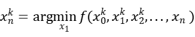 

每次得到新的都要用到后续的计算中。

 

对Lasso目标函数：

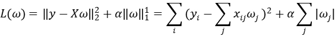

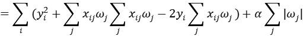

 *写成向量的形式。

对目标函数做坐标下降，分别对每个维度求偏导：

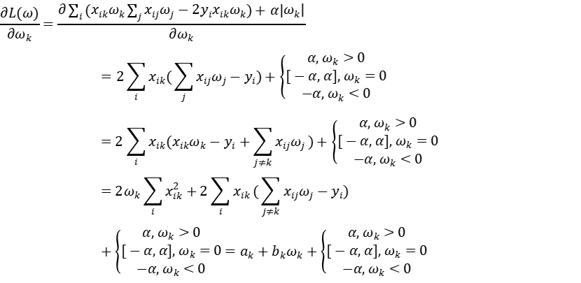

令偏导数为0得到极值，暂时先不考虑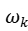的大小:

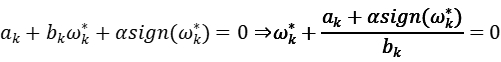

注意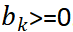。

1. 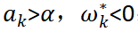，才能使偏导为0；

2. 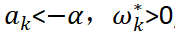才能使偏导为0;

3. 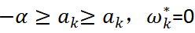才能使偏导为0;

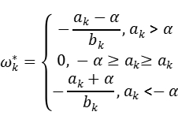


##### Python实现

```python
import numpy as np

class LinearRegression():

    def __init__(self, penalty='l2', alpha=1.0, coef_init=None):
        # 没有偏置参数b0
        # 偏置对应输入Xi0 = 1，需要对X加上一个值全为1的特征列。
        self.coef_ = None
        self.penalty = penalty
        self.alpha = alpha
        self.indexs = None
        self.__coef_length = None
        self.coef_init = coef_init

    def __init_coef(self, n_feature, X_dtype):
        if self.coef_init is None: 
            # 默认是0
            self.coef_ = np.zeros((n_feature, 1), dtype=X_dtype, order='F')
        else:
            self.coef_ = self.coef_init.reshape((n_feature, 1))
        self.__coef_length = n_feature
            
    def fit(self, X, y):
        if X.ndim != 2:
            X = X.reshape(-1, 1)
        if y.ndim == 1:
            y = y.reshape(-1, 1)
        n_sample, n_feature = X.shape
        self.__init_coef(n_feature, X.dtype)
        if self.penalty == 'l2':
            self.ridge_solvor(X, y, n_feature)
        else:
            self.lasso_solver(X, y, n_feature)

    def predict(self, X):
        if X.shape[1] != self.__coef_length:
            raise ValueError("Input array shape dismatch." +
                             "Require (n, {}).".format(
                             self.__coef_length))
        yp = np.dot(X, self.coef_)
        return yp.reshape(-1, 1)

    def ridge_solvor(self, X, y, n_feature):
        n_sample, n_feature = X.shape
        A = np.dot(X.T, X) + self.alpha*np.eye(n_feature, n_feature)

        self.coef_ = np.dot(np.linalg.inv(A), np.dot(X.T, y))

    def lasso_solver(self, X, y, n_feature):
        n_sample, n_feature = X.shape
        if X.flags['F_CONTIGUOUS'] is False:
            X = np.asfortranarray(X)
        self.indexs = [True for i in range(n_feature)]
        for k in range(n_feature):
            self.coordinate_descent_task(X, y, k)    

    def coordinate_descent_task(self, X, y, index):
        self.indexs[index] = False
        xw_out_k = np.dot(X[:, self.indexs], self.coef_[self.indexs])
        ak = 2*np.dot(X[:, index].T, (xw_out_k - y))
        bk = 2*np.dot(X[:, index].T, X[:, index])
        if ak > self.alpha:
            self.coef_[index] = -(ak - self.alpha)/bk
        elif ak < -self.alpha:
            self.coef_[index] = -(ak + self.alpha)/bk
        else:
            self.coef_[index] = 0
        self.indexs[index] = True

    def score(self, X, y):
        if X.ndim != 2:
            X = X.reshape(-1, 1)
        if y.ndim == 1:
            y = y.reshape(-1, 1)
        n_sample, n_feature = X.shape
        yp = self.predict(X)
        temp = yp - y
        return np.dot(temp.T, temp)/n_sample

```

```python
linear = LinearRegression(penalty='l1', alpha=0.01)
x = np.array([[1.0,2,3],[1,2,3]]).T
y = np.array([2,4,6])
linear.fit(x, y)
print(linear.score(x, y))
```

