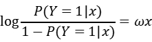
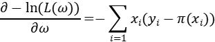
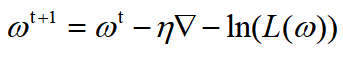

# Logistic回归

### Logistic分布


概率密度函数：


### 二项Logistics模型

假设**分类的值为{0, 1}**，**每个分类都服从logistic分布**，概率模型。


由于二者互斥


进一步简化，

Odd:一个事件的几率，是指在事件发生的概率与该事件不发生的概率的比值。对于逻辑回归模型，它的对数几率为：



在逻辑回归模型中，输入Y=1的对数几率是输入x的线性函数。

### 参数估计

采用最大似然估计：


对数似然函数：


最大化似然值等价于最小化负似然值，该函数是一个高阶连续可导的凸函数，可以用梯度下降法求解

梯度：


写成向量的形式：

梯度下降：



### python实现

 梯度下降优化的python实现，详细了解梯度下降可以参考http://sofasofa.io/tutorials/python_gradient_descent/4.php。

```python
import numpy as np
import random


class LogisticRegression():

    def __init__(self, tol, alpha, max_iter=1000, random_state=None):
        self.tol = tol  # 梯度下降停止的阈值，与loss的值比较
        self.alpha = alpha  # 梯度下降的更新步长
        self.max_iter = max_iter
        self.random_state = random_state
        self.coef_ = None

    def sparse_y(self, y):
        temp = [[0, 1] if val == 1 else [1, 0] for val in y]
        temp = np.array(temp)
        # y->nx2的矩阵
        self.y_sparse = temp

    def cross_entropy(self,X, y):
        # 优化的目标是最小化负对数似然函数
        # 与最小化交叉熵等价
        n_sample, _ = X.shape
        exp_x = np.exp(np.dot(X, self.coef_))
        p_y0 = np.reciprocal(exp_x + 1)
        log_p_y0 = np.log(p_y0)
        p_y1 = 1 - p_y0
        log_p_y1 = np.log(p_y1)
        result = np.dot(self.y_sparse[:, 0].T, log_p_y0) +\
                 np.dot(self.y_sparse[:, 1].T, log_p_y1)
        return -result/n_sample

    def update_coef(self, grad):
        self.coef_ = self.coef_ - self.alpha*grad

    def compute_grad(self, x, y):
        # 注意这里x是样本xi, y是样本标签yi
        n_feature, _ = self.coef_.shape
        grad = np.zeros((1, n_feature))
        exp_x = np.exp(np.dot(x, self.coef_))
        p_y1 = 1 - 1/(exp_x + 1)
        temp = y - p_y1
        grad -= x*temp
        return grad.T

    def SGD_solver(self, X, y):
        # 随机梯度下降
        # 更新梯度时每次随机选取一个样本，优点计算速度快
        n_sample, n_feature = X.shape
        num = n_sample - 1
        self.sparse_y(y)
        pre_loss = self.cross_entropy(X, y)
        if self.random_state:
            random.seed(self.random_state)
        for _ in range(self.max_iter):
            idx = random.randint(0, num)
            # 用抽取的样本计算梯度
            grad = self.compute_grad(X[idx], y[idx])
            self.update_coef(grad)
            loss = self.cross_entropy(X, y)
            # 计算|pre_loss - loss|决定是否停止迭代
            if abs(pre_loss - loss) <= self.tol:
                break
            pre_loss = loss
            print("current loss:", loss)

    def predict(self, X):
        exp_x = np.exp(np.dot(X, self.coef_))
        p_y0 = np.reciprocal(exp_x + 1)
        p_y1 = 1 - p_y0
        yp = [0 if y0 >= y1 else 1 for y0, y1 in zip(p_y0, p_y1)]
        yp = np.array(yp).reshape(1, -1)
        return yp

    def fit(self, X, y):
        n_sample, n_feature = X.shape
        self.coef_ = np.zeros((n_feature, 1))
        self.SGD_solver(X, y)
        return self
```

```python
lr = LogisticRegression(0.001, 0.01, 100, 123)
x = np.array([[1, 2, 3],
              [1, 10, 9],
              [2, 2, 2],
              [10, 1, 1],
              [12, 3, 9]])
y = np.array([[1],
              [1],
              [1],
              [0],
              [0]])
lr.fit(x, y)
yp = lr.predict(x)
lr.predict(np.array([10, 2, 3]))
```

### 参考资料

周志华《机器学习》

李航 《统计学习方法》

[自己动手用python写梯度下降](http://sofasofa.io/tutorials/python_gradient_descent/4.php)

